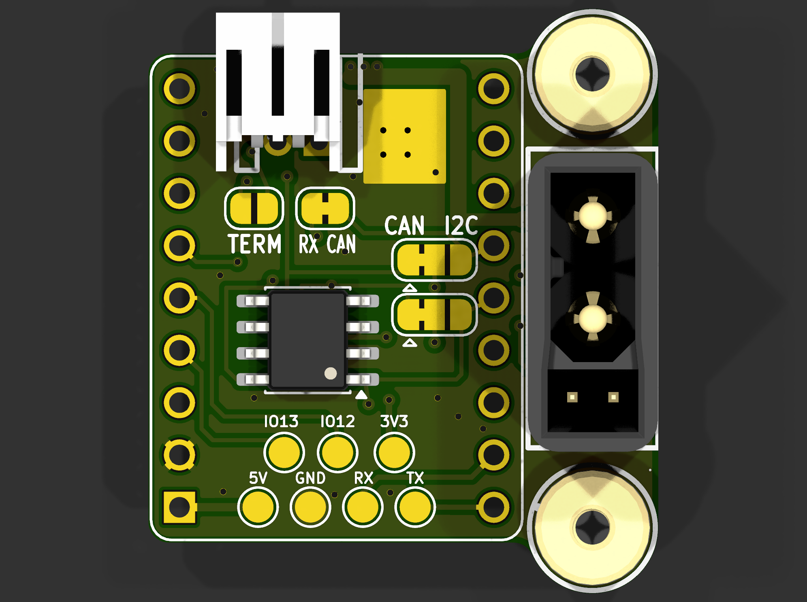
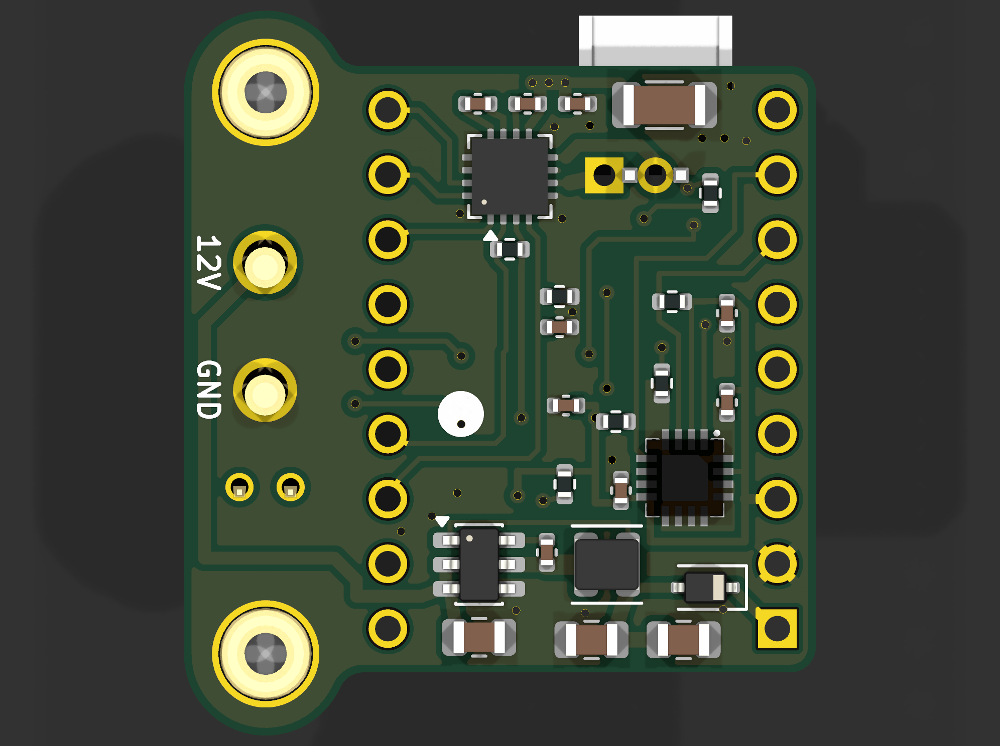
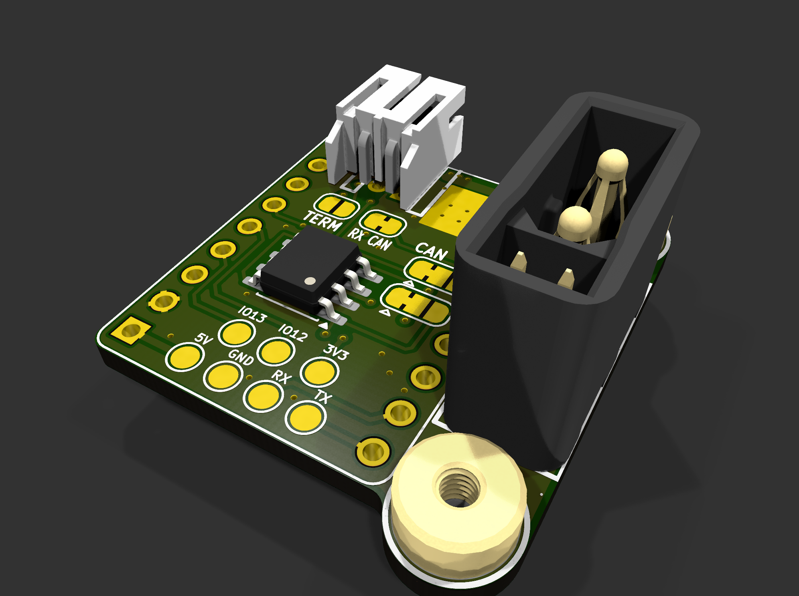
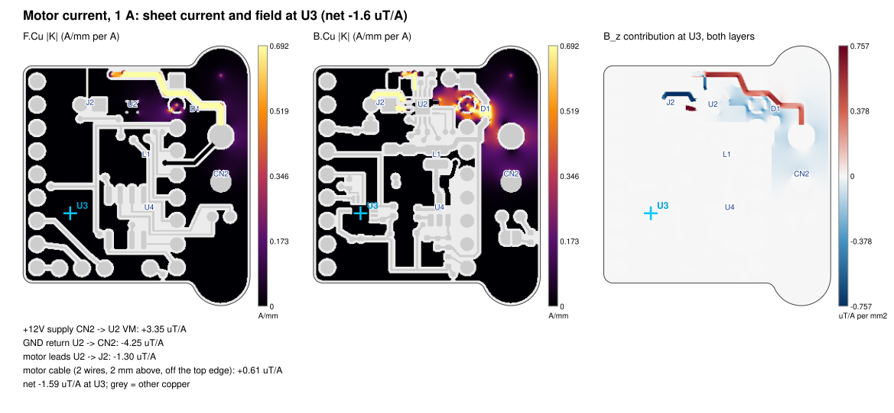
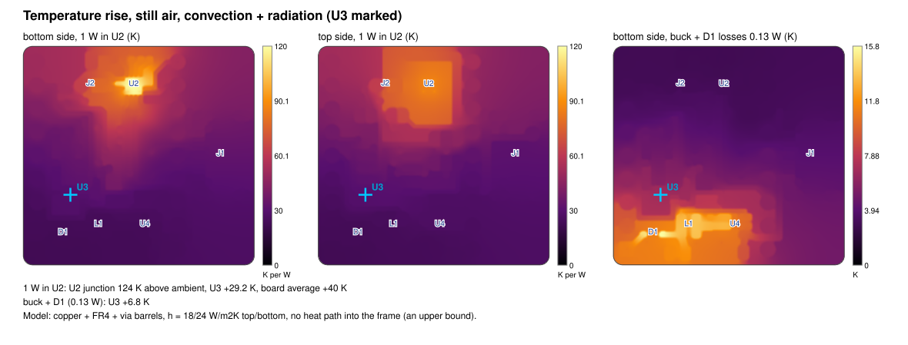
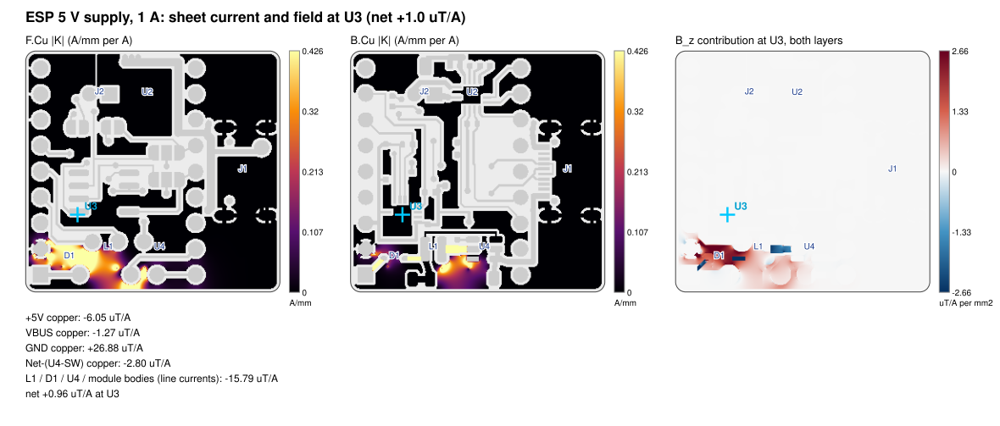

# PCBs

KiCad 10 projects for the lock-picking robot. This README covers the **main board** in [`main-board/`](main-board/). The splitter in [`splitter/`](splitter/) isn't documented here yet.

> **Naming.** The main board is the per-arm controller: one ESP32-S3, one motor driver and one magnetometer per arm. Its schematic title is "Lock Picking Robot - Arm Board", and the firmware calls it `arm`. The splitter's "main board" port feeds a different board, the motherboard.

## Contents

1. [At a glance](#at-a-glance)
2. [Production files](#production-files)
3. [3D renders](#3d-renders)
4. [File structure](#file-structure)
5. [Component choices](#component-choices)
6. [Layout decisions](#layout-decisions)
7. [Checks performed](#checks-performed)
8. [Issues that might arise](#issues-that-might-arise)
9. [Heat and current analysis](#heat-and-current-analysis)
10. [Cost](#cost)
11. [Scripts](#scripts)
12. [Working on the board in KiCad](#working-on-the-board-in-kicad)
13. [Revision history](#revision-history)

## At a glance

| | |
|---|---|
| Function | Drives one arm's brushed DC motor and measures the carriage position from a magnet |
| MCU | ESP32-S3 SuperMini module on 2 × 9-pin 2.54 mm sockets |
| Motor driver | TI DRV8876 (PH/EN, current sense, 2.2 A current limit) |
| Position sensor | Melexis MLX90393 3-axis magnetometer, centred over the carriage magnet |
| Power | 12 V from the splitter → AP63205 buck → 5 V → SuperMini (its own LDO makes 3.3 V) |
| Link to the motherboard | AMASS XT30 (2+2) connector carrying 12 V and **CAN** (default) or I²C, chosen with solder jumpers |
| CAN transceiver | TI SN65HVD230 (U5, SOIC-8), hand-soldered on top under the SuperMini; 120 Ω termination on a jumper (fit it on one arm at most, see [termination](#can-or-i2c-select-u5-jp1-to-jp4-r5-r6-c13)) |
| Board | 24.7 × 23.75 mm rectangle with 1 mm corners, plus two R 3.2 mm bulges around the M2 nuts at the connector end (24.7 × 28.4 mm overall); 2 layers, 1.6 mm FR4, 1 oz copper. A Ø2.5 mm circle on the back silkscreen marks the old shaft-hole position |
| Assembly | Bottom side by JLCPCB (Economic PCBA); top side hand-soldered (SuperMini sockets, U5, CN2 XT30, J2, M2 nuts) |
| Revision | v2 rev 5, XT30 connector, new outline, heat-sink pad (2026-10-06) |
| Status | DRC 0 errors, ERC 0 errors. **Update the firmware pin map and add a CAN (TWAI) driver before powering it** ([I1](#i1-firmware-pin-map-is-still-v1)) |

## Production files

All production files are generated by [`scripts/generate_production.py`](#scripts) into [`main-board/production/`](main-board/production/), in three folders:

- [`JLC/`](main-board/production/JLC/): everything to upload to JLCPCB.
- [`CAD/`](main-board/production/CAD/): STEP model, 3D renders and the component layout DXF.
- [`analysis/`](main-board/production/analysis/): DRC report and the current / field / heat analysis.

The manifest stays at the top of `production/`.

| File | Use |
|---|---|
| [Gerber + drill zip](main-board/production/JLC/Lock-Picking-Robot_v2_JLCPCB_gerbers.zip) | Upload to JLCPCB (11 files) |
| [BOM](main-board/production/JLC/Lock-Picking-Robot_v2_JLCPCB_BOM.csv) | JLCPCB assembly BOM: 25 parts on 18 lines, all with LCSC numbers |
| [CPL](main-board/production/JLC/Lock-Picking-Robot_v2_JLCPCB_CPL.csv) | JLCPCB pick-and-place (all bottom side) |
| [IPC-D-356 netlist](main-board/production/JLC/Lock-Picking-Robot_v2_netlist.ipc) | Optional upload, for JLC's electrical test |
| [STEP model](main-board/production/CAD/Lock-Picking-Robot_v2_3D.step) | Assembled board for CAD; every part except the SuperMini |
| [Component layout DXF](main-board/production/CAD/Lock-Picking-Robot_v2_component_layout.dxf) | Outline, mounting holes, ESP32 pins and non-passive courtyards; no text, for Onshape sketches |
| [DRC report](main-board/production/analysis/Lock-Picking-Robot_v2_DRC_report.txt) | Taken before each build |
| [Analysis numbers](main-board/production/analysis/Lock-Picking-Robot_v2_analysis.txt) and maps | See [Heat and current analysis](#heat-and-current-analysis) |
| [Manifest](main-board/production/Lock-Picking-Robot_v2_manifest.txt) | What the last build produced, plus its warnings |

### Ordering at JLCPCB

1. Upload the Gerber zip: 2 layers, 1.6 mm, HASL. ENIG is optional.
2. Choose **PCB Assembly → Economic → Bottom side**.
3. Upload the BOM and CPL. Check every part's pin 1 in JLC's placement preview, especially U2, U3, U4 and D1.
4. JLC doesn't fit these; hand-solder them on the top side:
   - U5 (SN65HVD230DR, C12084), **before** the SuperMini headers: it sits under the module;
   - U1 (SuperMini + two 9-pin female headers);
   - CN2 (AMASS XT30APB(2+2)-M, C53065086), the 12 V + bus connector;
   - J2 (JST S2B-PH-K-S, C173752);
   - H1/H2 (M2 SMD nuts SMTSOM225BTR, C5301773). Use a hot plate or hot air: they sit on solid GND.
5. The solder jumpers come set for CAN with no termination. Change them before fitting the SuperMini ([CAN or I²C](#can-or-i2c-select-u5-jp1-to-jp4-r5-r6-c13)).

## 3D renders

| Top | Bottom (JLC-assembled side) |
|---|---|
|  |  |



## File structure

```
PCB/
├── README.md                         this file: all main-board notes
├── splitter/                         splitter board (not covered here)
└── main-board/
    ├── main-board.kicad_pro          KiCad project (open this)
    ├── main-board.kicad_sch          schematic
    ├── main-board.kicad_pcb          board
    ├── main-board.kicad_dru          custom DRC rules (see Layout decisions)
    ├── fp-lib-table, sym-lib-table   point KiCad at libraries/
    ├── libraries/                    everything the project needs, bundled
    │   ├── main-board.kicad_sym      7 symbols: SuperMini, DRV8876, MLX90393, XT30 (2+2), JST-PH, M2 nut, USB-C (unused since rev 5)
    │   ├── main-board.pretty/        7 footprints (custom or edited; the USB-C one is unused since rev 5)
    │   └── 3dmodels/                 5 STEP models: XT30 (2+2), JST-PH, M2 nut, MLX90393, USB-C (unused)
    ├── scripts/
    │   ├── generate_production.py    builds everything in production/
    │   └── board_analysis.py         current / field / heat maps (run by the above)
    └── production/                   generated only: never edit by hand
        ├── JLC/                      Gerber zip, BOM, CPL, netlist
        ├── CAD/                      STEP, renders, DXF
        └── analysis/                 DRC report, current / heat maps and numbers
```

Local, git-ignored: `*.kicad_prl` (per-user view settings), `*-backups/` and `.history/` (KiCad's own backups), `fp-info-cache`, lock files and `__pycache__/`. The ignore rules are in [`main-board/.gitignore`](main-board/.gitignore).

The project footprints:

| Footprint | Used by | Why it's custom |
|---|---|---|
| `ESP32-S3-SuperMini` | U1 | Module on 2.54 mm headers (pin 13 corrected onto the grid in rev 3c) |
| `QFN-16-1EP_3x3mm_P0.5mm_EP1.68x1.68mm_ThermalVias0.3` | U2 | DRV8876 RGT with 4 thermal vias and 5-window paste. Named `QFN-` so the JLC rotation correction applies |
| `VQFN-16_L3.0-W3.0-P0.50-BL-EP1.7` | U3 | EasyEDA land pattern for the MLX90393 |
| `CONN-TH_XT30APB` | CN2 | EasyEDA land pattern for the AMASS XT30APB(2+2)-M (C53065086), bundled from the EasyEDA library with its STEP model |
| `USB-C_HX-TYPE-C-16PIN_NPTH-pegs` | (none) | Rev 4's USB-C receptacle, kept in the library but no longer used |
| `CONN-TH_S2B-PH-K-S-LF-SN` | J2 | EasyEDA JST-PH side-entry connector |
| `M2_SMD_nut_SMTSOM225_ring4.2` | H1, H2 | M2 SMD nut, 4.2 mm plated ring and 3.7 mm hole |

## Component choices

### 12 V + CAN/I²C in: CN2, XT30 (2+2)

- **Part:** AMASS XT30APB(2+2)-M (LCSC C53065086), the vertical PCB-mount male: the plug goes in from the top, on the SuperMini side. Its body (14.5 × 6.3 mm, about 10.8 mm tall) sits flush with the right board edge. AMASS also makes a right-angle XT30PW(2+2) if the cable should leave sideways.
- **Pins:** pin 4 = +12 V, pin 3 = GND (the two 2.5 mm power pins, 5 mm apart); pin 2 = BUS_P, pin 1 = BUS_N (the two small signal pins). The connector is polarised; check the cable and the splitter/motherboard use the same pin order.
  - CAN (default): BUS_P = CANH, BUS_N = CANL.
  - I²C (jumpers changed): BUS_P = SDA, BUS_N = SCL.
- **GND pin:** connected solid (no thermal spokes) to both GND pours, because it carries the motor return.
- **Pull-ups (I²C mode only):** the motherboard provides them, because all six arms share the bus. R7 (10 kΩ, below) also pulls SDA up on every arm, so six arms add about 1.7 kΩ in parallel on SDA; SCL has no on-board pull-up.
- **Probe points:** rev 4's TP8/TP9 are gone (no room next to the XT30). Probe +12 V and GND on CN2's pins from the back.

### CAN or I2C select: U5, JP1 to JP4, R5, R6, C13

- **U5, SN65HVD230DR:** 3.3 V CAN transceiver in SOIC-8, hand-soldered on the top side under the SuperMini.
  - TXD (pin 1) is on SDA_CANTX = GPIO3; RXD (pin 4) reaches SCL_CANRX = GPIO4 through JP3.
  - R7 (10 kΩ, bottom, under U5's TXD pin) pulls TXD up to 3.3 V. GPIO3 has no internal pull and floats while the ESP32 resets, boots or is flashed, and the SN65HVD230 has no TXD pull-up and no dominant time-out; without R7 a resetting arm could hold the whole bus dominant.
  - Rs (pin 8) goes to GND through R6 (10 kΩ), which selects slope control (the fastest slope-control setting; ground Rs directly for high-speed mode). Vref (pin 5) is left open.
  - C13 (100 nF) decouples VCC from the bottom side, right under pin 3 (one via and a 0.5 mm top-side stub).
- **Solder jumpers** (top side, all under the SuperMini; labelled on the silk):

| Jumper | Pads | Default (as made) | For I²C |
|---|---|---|---|
| JP1, D+ select (right column, lower; "CAN · I2C" above JP2) | 1 = CANH, 2 = BUS_P, 3 = SDA_CANTX | 1–2 bridged = CAN | Cut 1–2, bridge 2–3 |
| JP2, D− select (right column, upper; "CAN · I2C") | 1 = CANL, 2 = BUS_N, 3 = SCL_CANRX | 1–2 bridged = CAN | Cut 1–2, bridge 2–3 |
| JP3, RX link ("RX CAN", next to U1 pin 4) | 1 = CAN_RXD, 2 = SCL_CANRX | Bridged | Cut, so U5's RXD can't fight SCL |
| JP4, termination ("TERM", left of JP3) | 1 = CANH, 2 = R5 | Open | Leave open |

- **Termination:** the arms hang off a star from the splitter, so the whole network needs exactly two 120 Ω terminations: for example the motherboard plus **one** arm, or a single 60 Ω at the splitter. Never bridge JP4 on every arm: seven 120 Ω in parallel is about 17 Ω and the bus won't work. Keep the bit rate modest (250 kbit/s default). R5 (120 Ω) sits across CANH–CANL when JP4 is bridged.
- **I²C mode:** U5 can stay fitted. With JP1/JP2 cut on 1–2, its CANH/CANL no longer reach CN2, so whatever SDA does to its TXD input goes nowhere. With JP3 cut, its RXD output is off SCL. U5 can also be left off.

### Power: U4, L1, D1

- **U4, AP63205WU-7:** a 3.8–32 V in, fixed 5.0 V, 2 A, 1.1 MHz synchronous buck. EN is tied to VIN, so it starts automatically.
  - A buck loses about 0.05 W here, where a linear 12→5 V regulator would put about 0.5 W next to the magnetometer.
  - C1 (10 µF 25 V) is in, C3/C4 (2 × 47 µF 6.3 V) are out, C2 is bootstrap and L1 is 4.7 µH (FTC252012S).
- **D1, 1N5819WS:** joins the buck's +5 V to the SuperMini's 5 V pin (VBUS ≈ 4.6 V). It stops the SuperMini's own USB from back-feeding the buck while programming.
- **+3V3:** comes from the SuperMini's LDO and feeds U3, the pull-ups and the DRV8876 VREF.
- **Rail loads:** +12 V feeds U2 (motor ≤ 1.5 A) and U4 (about 40 mA in). +5 V feeds the SuperMini and TP6.

### Motor driver: U2, DRV8876RGTR

- **Mode:** PMODE is tied to GND, giving PH/EN mode (EN = PWM, PH = direction). IMODE is tied to GND, giving fixed off-time chopping with auto-retry on overcurrent.
- **Current sense:**
  - R1 = 1.5 kΩ 1 %, so I_TRIP = 3.3 V / (1000 µA/A × 1.5 kΩ) = 2.2 A and IPROPI reads 1.5 V/A.
  - C12 (10 nF) stops motor transients tripping the limit early and smooths the ADC.
- **Decoupling and charge pump:** C5 (100 nF 50 V) and C6 (22 µF 25 V) sit right at VM/PGND. C7 (100 nF) is on VCP and C8 (22 nF) on CPH–CPL.
- **nFAULT:** pulled up to 3.3 V with 10 kΩ (R2).
- **Motor connector:** J2 pin 1 = OUT1, pin 2 = OUT2, a short side-by-side pair with a tiny loop.

### Magnetometer: U3, MLX90393SLW-ABA-011-RE

- **Interface:** I²C mode (CS high), A0 = A1 = GND, giving address 0x0C. INT goes to MAG_INT (data ready); INT/TRIG is left open.
- **Placement:** the Hall plates are at the package centre, so U3 is centred over the carriage magnet.
- **Decoupling:** C10 (100 nF, 1.0 mm from pin 8), C9 (100 nF, next to pins 2/15) and C11 (10 µF bulk).
- **Pull-ups:** R3/R4 are 2.2 kΩ on the local MAG I²C bus.

### MCU: U1, ESP32-S3 SuperMini on sockets

- **Mounting:** sits on 2.54 mm female headers on the top side, with its own USB-C at the board edge for programming.
- **Pin choice:** pins are picked so each block routes on one layer without crossings.

| SuperMini pin | Net | Use |
|---|---|---|
| GPIO1 | DRV_IPROPI | Motor current (ADC1_CH0, works with Wi-Fi on), 1.5 V/A |
| GPIO2 | DRV_nFAULT | Driver fault input (10 k pull-up) |
| GPIO3 / GPIO4 | SDA_CANTX / SCL_CANRX | Bus to the motherboard via CN2: CAN TX/RX through U5 by default, or I²C SDA/SCL with JP1–JP3 changed (GPIO3 strapping only matters if the eFuse is burnt) |
| GPIO5 | DRV_nSLEEP | Drive **high** to run |
| GPIO6 | DRV_IN2_PH | Direction |
| GPIO7 | DRV_IN1_EN | PWM |
| GPIO8 | — | Free |
| GPIO9 / GPIO10 / GPIO11 | MAG_SDA / MAG_SCL / MAG_INT | Magnetometer |
| GPIO12 / GPIO13 | EXP_IO12 / EXP_IO13 | Spare, on pads TP1/TP2 |
| TX / RX (GPIO43/44) | EXP_TX / EXP_RX | On pads TP3/TP4. TX prints the ROM boot log at reset |
| 5V / 3V3 / GND | VBUS / +3V3 / GND | VBUS ≈ 4.6 V after D1 |

GPIOs are 3.3 V only: they are **not** 5 V tolerant.

### Test and wire pads

| Pads | Side | Nets | Notes |
|---|---|---|---|
| TP1–TP7 | Top, 1.5 mm | IO12, IO13, TX, RX, 3V3, 5V (VBUS), GND | Labelled on the silk. Glue wires down so the pads don't lift |

### Mechanical parts and passives

- **H1/H2:** SMTSOM225BTR M2 SMD nuts, 22 mm apart at (39.6, 22.65) and (39.6, 44.65) since rev 5, each in its own semicircular bulge of the outline. They are tin-plated copper, so non-magnetic and fine near U3.
- **J2:** JST S2B-PH-K-S, side entry; its body overhangs the top edge by design.
- **Passives:** all are JLC **Basic** parts, so there are no feeder fees.
- **Capacitor derating** at working voltage:

| Cap | Rating | Working voltage | Effective value |
|---|---|---|---|
| C6 | 22 µF / 25 V | 12 V | ≈ 9 µF |
| C1 | 10 µF / 25 V | 12 V | ≈ 3.5 µF |
| C3, C4 | 47 µF / 6.3 V | 5 V | ≈ 10 µF each |
| C11 | 10 µF / 6.3 V | 3.3 V | ≈ 3 µF |

## Layout decisions

- **Sides.**
  - **Bottom:** every JLC-assembled part and most signals.
  - **Top:** the hand-fitted parts, a GND pour, the 12 V track and short hops.
  - Bottom parts stay ≥ 0.9 mm from the U1/J2 through-hole pins so those can be hand-soldered (closest: C11 to U1 pin 11, 0.91 mm). The front 12 V track passes 0.216 mm from ESP pins 4 and 5 (mask-covered): solder those header pins carefully, a bridge puts 12 V on a GPIO.
- **12 V path (rev 5).** CN2 pin 4 → a 0.8 mm front track → 0.6 mm between ESP pins 5 and 4 → up inside the right header at x = 33.1 → along the top edge → 3 vias → C5/C7/U2 VM. It runs over the motor GND return on the back, so the motor loop stays small. The buck is fed by a 0.5 mm back track that leaves CN2 pin 4 to the right, runs down the right edge and below the XT30, so it doesn't wall CN2's GND pin off from U2's ground on the back.
- **Motor loop.**
  - OUT1 runs to J2 in 0.6 mm (≈ 2.3 mm), OUT2 in 0.5 mm (≈ 5 mm, between C5's GND via and J2 pin 1), both with 0.25 mm necks at U2's pins.
  - The return goes from U2 to CN2's GND pin through the back GND, under the 12 V feed. A 0.2 mm notch in the front pour between J2's pins keeps U2's front GND from joining the top-left pour and the left-edge GND link; without it the return loops around U3 (15 µT/A instead of 1.6).
- **Magnetometer.** U3 is centred on the magnet. The MAG I²C lines run on the back, ≥ 2.0 mm from J2 and the motor copper, and ≥ 0.5 mm from every switching CAN track (only the static CAN_RS is closer, 0.23 mm to MAG_SCL). Since rev 4 only part of them has front GND above ([W12](#warnings)).
- **CAN block (rev 4b, hand-placed and hand-routed; coordinates below are rev 4b's, before rev 5 moved the whole board by (+6.1, +9.65) mm).** The space under the SuperMini is tight, so the parts sit where the copper leaves room:
  - U5 at (19.7, 25.9), rotated 180° (pins 1–4 face U1's right-hand pins; CANH/CANL on the left side);
  - JP2 (y 22.0) and JP1 (y 24.66) in one column at x = 25.85, next to U1 pins 3/4 and J1, CAN pads on the left and I²C pads on the right; nothing in the pocket above U2;
  - JP4 (17.1, 19.5) and JP3 (20.55, 19.5) in one row above U5;
  - R5, R6 and C13 on the bottom (C13 under U5's VCC pin); R7 (rev 5) on the bottom at (27.9, 38.0), between the +3V3 and +5V feedback tracks, with one via up to TXD.
  - CANL and CANH leave U5 under its body. CANH hops to the back once (x = 20.85) to reach JP4, and CAN_RXD hops once (x = 20.15) to reach JP3. CAN_RS runs up the left of U5 to R6.
  - BUS_N/BUS_P drop to the back between JP2 and JP1 and below JP1, cross the gaps between ESP pins 4/3 and 3/2, then go back to the top through a via each and run to CN2's signal pins. DRV_nFAULT moved down on the back to make room.
- **Heat-sink pad (rev 5).** A 3.8 × 4.4 mm bare-copper GND pad on the top (F.Cu + mask opening) right over U2, between J2's housing, JP3 and the 12 V track, stitched to U2's 4 thermal vias plus 3 GND vias. It takes a small stick-on sink under the SuperMini. Use **aluminium or copper, never steel or ferrite**: a magnetic sink would bend the field at U3. Use electrically insulating thermal tape if the sink overhangs the masked 12 V track, and check the height under the module (sockets ≈ 8.5 mm, INFERRED; keep the sink well below that).
- **Outline (rev 5).** One closed Edge.Cuts loop: the rectangle (x 18.075–42.8, y 21.625–45.375) with 1 mm corners, and R 3.2 mm bulges centred on H1/H2 joined to the top/bottom edges by 1 mm fillets and tangent into the right edge. The right edge is exactly vertical at x = 42.8, the XT30 body line.
- **Distances from U3's centre (rev 4b, in plan):**

| To | Distance |
|---|---|
| J2 pins | 11.2 mm |
| MOT_OUT copper | 11.2 mm |
| U2 | 13.6 mm |
| +12 V copper | 9.1 mm |
| U4 | 8.7 mm |
| L1 | 4.6 mm |
| D1 | 4.4 mm |
| SW node | 4.1 mm |
| JP1 (CAN bus jumper, top side) | 9.4 mm (was right over U3 in rev 4) |
| BUS_P/BUS_N copper | 8.7 mm |
| CANH/CANL copper | 1.3 mm |
| U5 | 3.4 mm |

- **Zones.** GND pours sit on both layers (no +12 V pour since rev 4b). SMD pads join the pours by tracks only (`thru_hole_only`), which prevents 0402 tombstoning. Zone clearance is 0.25 mm and the minimum width is 0.2 mm.
- **Rules.** The default net class is 0.2 mm track and 0.2 mm clearance. Vias are 0.6/0.3 mm (some 0.5/0.3). `main-board.kicad_dru` adds:
  - U1 sits on sockets, so parts may sit under its courtyard;
  - TP courtyards may overlap (2.54 mm grid);
  - copper to the board edge is 0.3 mm (JLC's routed-edge minimum);
  - J1's peg holes may sit 0.15 mm from its own pads (vendor land pattern; no longer used since rev 5).
- **Carriage fit (rev 3c).** U3 and the Ø2.5 mm shaft hole were moved 3.5 mm in +y. Both still sit over the carriage's magnet and top-right holes, while the board edge moves 3.5 mm away from the carriage shaft:

| Check (from `mechanical/carriage-base.dxf`) | Result |
|---|---|
| Carriage rotation relative to the board | 15.9° |
| Board edge to shaft centre | 4.32 mm |
| Clearance from the Ø6.9 mm shaft hole | 0.87 mm |
| Overlap with the R5 boss | 0.68 mm |

- **rev 3c re-route.**
  - +3V3 now runs left of and under U3, between U3 and the buck, to pin 8, then up x = 20.6 to R2 and across to the TP5 via.
  - DRV_IPROPI passes under the shaft hole.
  - DRV_nFAULT passes over the hole and down the single-track gap to ESP pin 2.
  - The buck's +5 V feedback line moved 0.25 mm down to clear C10.
- **rev 4 re-route (CAN).**
  - The old I²C tracks from J1's D+/D− straight to ESP pins 3/4 were removed; they would bypass the jumpers.
  - The +3V3 hop that fed R2 and U2 VREF across DRV_IPROPI moved off the top at y = 19.9: it now runs down the back between DRV_IPROPI and DRV_nFAULT, crosses under U5 on the top and joins the x = 20.6 +3V3 track.
  - Two GND stitching vias were removed to make room: (21.7, 18.4) and (26.3, 19.8).
  - Two GND link tracks (about 3 mm under U5 and 10 mm on the left) keep the U3 and U5/R1/C12 ground areas tied to the main GND. Without them the front pour splits into islands.
  - The CAN tracks were laid out with a scripted grid router (not part of this repo), then checked with KiCad DRC.

## Checks performed

All checks were last run on rev 5 (2026-10-06). Rows marked "rev 3c" or "rev 4" were not re-run.

| # | Check | Result | Status |
|---|---|---|---|
| 1 | KiCad DRC, custom rules, all track errors | 0 errors, 0 unconnected, 0 schematic-parity issues; 29 warnings (22 silkscreen, 7 labels at 0.5 mm text below the 0.8 mm rule) | OK |
| 2 | KiCad ERC | 0 errors; 38 pin-type warnings from the EasyEDA symbols | OK |
| 3 | Copper clearance | ≥ 0.200 mm by DRC (rule 0.2, JLC 0.127); independent re-measure is rev 3c | OK |
| 4 | Copper to edge | ≥ 0.300 mm | OK |
| 5 | Hole-to-hole spacing | ≥ 0.25 mm by DRC | OK |
| 6 | Tracks, vias, annular rings | Tracks ≥ 0.2 mm; 37 vias, 0.3 mm drill with ≥ 0.1 mm ring | OK |
| 7 | Acid traps, duplicate or dangling tracks | DRC: no dangling tracks or vias; acid traps not re-checked since rev 3c | OK |
| 8 | ESP32 socket pin grid | All 18 holes on 2.54 mm | OK |
| 9 | MAG I²C over front GND | 27 % of MAG_SDA and 40 % of MAG_SCL have front GND above (40 / 40 % in rev 4b, 41 / 31 % in rev 4, 94 / 92 % in rev 3c). MAG_SDA now runs between the CANL and CANH front tracks instead of under CANH | Warning |
| 10 | MAG lines to motor copper | 2.05 mm (needs ≥ 1.2) | OK |
| 11 | Crosstalk (parallel runs ≤ 1 mm apart) | CAN to MAG lines, same layer: CANH 0.55 mm, CANL 0.53 mm, CAN_RXD 0.75 mm; CAN_RS (static) 0.23 mm from MAG_SCL. CANH no longer runs over MAG_SDA | OK |
| 12 | Power-path resistance / current density | +12 V 13.7 mΩ, GND 3.5 mΩ (rev 4b: 13.5 / 5.6, rev 4: 9.5 / 5.7); peak 4.7 A/mm per A on the short U2 VM stub; narrowest +12 V copper 0.6 mm (between ESP pins 5/4) | OK |
| 13 | ESP 5 V loop field at U3 | 0.2 µT/A (near-cancellation, model-sensitive) | OK |
| 14 | Decoupling at U3 | C10 1.0 mm from pin 8, C9 2.4 mm from pin 2 | OK |
| 15 | Hand-solder clearance to U1/J2 pins | 0.91 mm (C11 to U1 pin 11) | OK |
| 16 | Production files vs board | Drill file: 67 plated hits (37 vias + 4 U2 thermal vias + 18 U1 + 4 CN2 + 2 J2 + 2 nuts), no NPTH | OK |
| 17 | BOM sourcing | 25 placements (bottom only), all with LCSC numbers; single-sided Economic assembly (U5, CN2, J2, SuperMini and nuts hand-fitted) | OK |
| 18 | Libraries | All bundled in `libraries/`; no missing-library or mismatch warnings | OK |
| 19 | Motor-current field at U3 | 1.1 µT/A ([details](#motor-current-field-at-the-magnetometer)) | OK |
| 20 | Carriage fit: shaft boss, screws, alignment | See [W1–W3](#warnings) | Warning |
| 21 | STEP completeness | Every part except U1 (no SuperMini model) and JP1–JP4 (no model in the KiCad library) | Warning |
| 22 | Silkscreen | J2 overhangs the edge, CN2's outline sits on the edge; EasyEDA silk lines 0.06 mm; label text 0.5–0.8 mm; U1's outline crosses J2's | Warning |
| 23 | Firmware pin map | Still v1 | **Issue** |
| 24 | 12 V on a USB-C connector | Gone since rev 5 (XT30) | OK |
| 25 | Heat reaching U3 | +28.0 K per W in U2 bare, 12.1 K with a 40 K/W sink on the new pad | **Issue** (accuracy) |
| 25a | CAN bus current field at U3 | −0.6 µT/A bus loop, +1.0 µT/A JP4 termination loop (rev 4: 37 / 2.3 µT/A with the same method), so ≈ 0.02 µT during dominant bits ([W11](#warnings)) | OK |
| 26 | U2 at 1 A continuous | 124 K/W (129 in rev 4, 111 in rev 3c); reaches thermal shutdown in still air | **Issue** |

## Issues that might arise

### I1. Firmware pin map is still v1

`firmware/common/config.h` still has the v1 pins (`MAG_SDA/SCL 41/40`, `COMMS 21/22`, `PIN_CS 4`, `IN1_EN 5`, `MODE_PIN 7`, `CURRENT_SENSE_V_PER_A 2.5`). On this board that goes wrong in four ways:

- `magnet.begin()` never returns, because the SuperMini doesn't break out 41/40;
- PWM goes to nSLEEP;
- driving "MODE" low holds the bridge in brake;
- current sensing reads I2C_SCL.

The link to the motherboard is CAN by default since rev 4, and the firmware has no CAN code yet (`firmware/arm/comms.h` only starts `Serial`).

**Fix:** use the [pin map above](#mcu-u1-esp32-s3-supermini-on-sockets) and 1.5 V/A before the first power-up. For CAN, drive the ESP32-S3 TWAI controller with TX = GPIO3 and RX = GPIO4. For I²C, change JP1–JP3 first ([CAN or I²C](#can-or-i2c-select-u5-jp1-to-jp4-r5-r6-c13)).

### I2. 12 V on a USB-C connector (fixed in rev 5)

Rev 4 used a USB-C receptacle for 12 V + bus, right next to the SuperMini's real USB-C port. Rev 5 replaces it with a polarised XT30 (2+2), which can't be confused with USB. Only check that the XT30 cables are wired with the same pin order at both ends.

### I3. Heat reaching the magnetometer

U3 rises 29.2 K per watt dissipated in U2, plus about 6.9 K from the buck and D1. The board takes about 100 s to warm up, so what matters is the motor's average power:

| Motor use | U2 power | U3 rise (steady state) |
|---|---|---|
| 0.5 A for 10 % of the time | ≈ 0.024 W | < 1 K |
| 0.5 A continuous | 0.24 W | ≈ 7 K |
| 1.0 A continuous | ≈ 1.1 W | ≈ 32 K (and U2 hits TSD, see I4) |

The firmware currently divides the field by a magnet tempco based on U3's *die* temperature, but the magnet doesn't see the board's heat. That adds about 1.2 % of B per +10 K: roughly 27, 41 and 58 µm at 2.5, 6 and 10.5 mm of travel.

**Fixes:**
- **Firmware (free):**
  - stop applying the magnet tempco from the die temperature;
  - enable `TCMP_EN`;
  - re-zero against an end stop now and then.
- **Hardware:** stick a heat sink on the rev 5 pad over U2 (aluminium or copper only). The rev 5 rows come from `board_analysis.py` (sink spread over the pad, in series with a 10 K/W thermal tape); the other sink rows were computed on rev 3c.

| Option | U2 junction per W | U3 per W in U2 |
|---|---|---|
| None (rev 3c) | 111 K | 35.4 K |
| None (rev 4) | 129 K | 28.9 K |
| None (rev 4b) | 124 K | 29.2 K |
| None (rev 5, as built) | 122 K | 28.0 K |
| 40 K/W stick-on sink on the rev 5 pad (3.8 × 4.4 mm) on 10 K/W tape | 77 K | 12.1 K |
| 20 K/W sink, same pad and tape | 70 K | 9.5 K |
| ~40 K/W stick-on sink, top side over U2 (rev 3c estimate, before the pad existed) | 77 K | 15.4 K |
| ~20 K/W sink, same place (rev 3c) | 69 K | 10.7 K |
| Small sink glued on U2's package (bottom side, if the carriage leaves room) | 50–56 K | 16–18 K |
| H1/H2 screwed into a metal frame (~10 K/W each) | 93 K | 22 K |

### I4. U2 at high continuous current

The DRV8876 junction runs at 122 K/W in still air (162 K/W with convection only) without a sink; rev 4b was 124, rev 4 129 and rev 3c 111 K/W. With a 40 K/W sink on the rev 5 pad it drops to about 77 K/W. The CAN tracks still box in part of the front copper around U2's thermal vias. At 1 A continuous, U2 dissipates about 1.1 W, so the junction reaches ≈ 165–185 °C, past its thermal-shutdown threshold. 1.5 A trips shutdown within seconds; the driver recovers by itself and pulls nFAULT low.

**Fix:**
- limit continuous current or duty, and read nFAULT (GPIO2);
- a heat sink (I3) makes 1 A continuous safe;
- on the next spin, the DRV8874PWPR has 3.5× lower loss.

### Motor-current field at the magnetometer

The motor current's own copper creates −1.1 µT per amp at U3's Hall plate in rev 5 (+1.6 in rev 4b, 1.5 in rev 4, 6.1 µT/A in rev 3c, 3.5 in rev 3b). The GND return to CN2 contributes −4.5 µT/A against the 12 V copper's +4.1 µT/A. The front-pour notch between J2's pins is what keeps it there (see [Layout decisions](#layout-decisions)). The error only exists while current flows. At the target, where precision matters, the controller's current is close to zero.

| Motor current | Error at 2.5 mm travel | at 6 mm | at 10.5 mm |
|---|---|---|---|
| 0.3 A | 0.07 µm | 0.3 µm | 1.4 µm |
| 1.0 A | 0.24 µm | 1.1 µm | 4.8 µm |
| 1.5 A | 0.36 µm | 1.7 µm | 7.2 µm |

(Scaled from the rev 3c table by 1.5 / 6.1.)

The firmware deadband is 10 µm.

**Fix if needed:**
- compensate in firmware, since the error is linear in current: B_corr = B_z − k·I_motor, with k calibrated with the magnet removed;
- or brake the motor during the ~25 ms conversion near the target;
- next spin: run a GND strip directly under the 12 V feed.

### Warnings

| # | Warning | What to do |
|---|---|---|
| W1 | **Shaft boss.** The board edge clears the Ø6.9 mm shaft hole by 0.87 mm but overlaps the R5 boss by 0.68 mm in plan view | Confirm in CAD that the boss doesn't reach the PCB plane |
| W2 | **Mounting screws.** The nuts moved again in rev 5: H1/H2 are now 22 mm apart at (39.6, 22.65)/(39.6, 44.65) (17 mm before), and the outline has bulges around them. The carriage DXF that W1–W3 were checked against is no longer in the repo (a copy is in `lock-picking-backups/wip-20261005/review/`) | Redraw the carriage's screw holes and pocket from `production/CAD/…component_layout.dxf`; re-check W1–W3 |
| W3 | **Magnet alignment.** U3 is 9.114 mm from the shaft hole, but the carriage's magnet is 9.000 mm from its hole | U3 sits within 0.11 mm of the magnet centre; calibrate in place |
| W4 | **Bottom side faces the carriage** | Make sure the carriage has pockets for the parts |
| W14 | **No shaft hole since rev 4.** The Ø2.5 mm hole is replaced by a silkscreen circle at (25.86, 25.60), on the back only since rev 4b (JP1 now sits there on the top). W1–W3 still refer to that position | If the carriage shaft needs to pass through the board, the hole has to come back |
| W5 | **No SuperMini 3D model** | Add an ESP32-S3 SuperMini STEP to `libraries/3dmodels/` and assign it to U1 |
| W6 | **Silkscreen.** 29 DRC warnings: J2 deliberately overhangs the edge and CN2's outline sits on it, some silk sits over pads, U1's outline overlaps J2 and H2, and seven labels use 0.5 mm text (rule 0.8 mm; JLC publishes 1.0 mm as its minimum). EasyEDA silk lines are 0.06 mm (JLC minimum 0.153); text is 0.8 mm (JLC recommends 1.0) | Cosmetic only |
| W7 | **No TVS on 12 V,** and ceramic-only bulk (about 12 µF effective): PWM ripple flows in the cable, and a hot-plug can overshoot towards 24 V against 25 V caps | Next spin: 47–100 µF polymer + SMAJ15A at J1; run PWM at 20–25 kHz |
| W8 | **Bus over the XT30 cable has no ESD protection.** In I²C mode there's no series R either, and SDA and SCL are coupled in the twisted pair | CAN (default) is the robust choice; for I²C keep ≤ 100 kHz. Next spin: a CAN TVS (e.g. PESD2CAN) at J1 |
| W11 | **CAN current near U3.** Rev 5: the bus loop gives −0.6 µT/A and the JP4 termination loop +1.0 µT/A at the Hall plate (≈ 0.02 µT while the bus is busy), so this is now negligible. History: in rev 4, JP1 sat right over U3, and the on-board bus loop (U5 → JP1 → J1 → JP2 → U5) gives 28 µT per amp at the Hall plate. Dominant bits drive about 33 mA into the two 120 Ω terminations, so about 0.9 µT while the bus is busy (≈ 0.7 µm at 6 mm travel, ≈ 3 µm at 10.5 mm). The JP4 termination loop adds −1.6 µT/A. In rev 4b JP1/JP2 moved to the right-hand column, 9 mm from U3; not re-computed | Keep the bus quiet during a position conversion near the target, or average over idle frames |
| W12 | **MAG I²C front-GND cover.** The CAN tracks on the top cut the front GND above the MAG lines: 27 % of MAG_SDA and 40 % of MAG_SCL are covered (40 / 40 % in rev 4b, 41 / 31 % in rev 4, 94 / 92 % in rev 3c); in exchange every switching CAN track is ≥ 0.5 mm from them | Keep the MAG bus at ≤ 400 kHz; next spin: move the CAN block so the front GND under U3's bus stays whole |
| W13 | **U5 under the SuperMini.** It's SOIC-8, 1.75 mm tall, hand-soldered, and can't be reworked once the headers are fitted. JP1/JP2/JP3/JP4 are only reachable with the module off | Fit and test U5 and set the jumpers before soldering the headers |
| W10 | **Background field.** The firmware uses \|B_z\|, so re-orienting the robot after calibration shifts readings by up to ±50 µT | Calibrate in the working orientation; subtract a parked-magnet baseline |

## Heat and current analysis

[`scripts/board_analysis.py`](main-board/scripts/board_analysis.py) produces these maps on every build.







**Method:**
- **Copper:** both layers (tracks, pads, vias and the stored zone fills) are rasterised on a 0.08 mm grid.
- **Current:** each current path is solved with its source pads at 1 V and its sink pads at 0 V, then scaled to 1 A.
- **Field:** a Biot–Savart sum gives B_z at U3's Hall plate, 0.5 mm below the bottom copper. Motor leads and the cable (two wires, 2 mm above, leaving the top edge) are included. In `analysis.txt`, + means towards the top face, and the sign flips with motor direction.
- **Heat:** a steady-state network of copper (35 µm, 385 W/mK), FR4 (1.6 mm, 0.3 W/mK) and via barrels (20 µm plating). It assumes still air and no heat path into the frame, so it is an upper bound. Losses into the air use h = 18/24 W/m²K top/bottom (10/12 for convection only), and RθJC(bot) of U2 is 7.1 K/W.
- **Validation:** run on rev 3b, the model reproduces the original review: U2 112 vs 117 K/W, U3 38.5 vs 39 K/W, motor loop 3.5 vs 3.4 µT/A.

| Result | rev 3c | rev 4 | rev 4b | rev 5 |
|---|---|---|---|---|
| Motor loop at U3, net (12 V copper / GND return / motor leads / cable) | 6.1 µT/A (+4.9 / −10.2 / −1.5 / +0.7) | 1.5 µT/A (+4.9 / −2.6 / −1.5 / +0.7) | 1.6 µT/A (+4.9 / −2.6 / −1.3 / +0.6) | −1.1 µT/A (+4.1 / −4.5 / −1.3 / +0.6) |
| ESP 5 V loop at U3 | 1.7 µT/A | 1.0 µT/A (near-cancellation of large terms; model-sensitive) | 1.0 µT/A | −0.2 µT/A |
| 12 V / GND path resistance | 9.1 / 2.1 mΩ | 9.5 / 5.7 mΩ | 13.5 / 5.6 mΩ | 13.7 / 3.5 mΩ |
| U2 junction, U3, board average per W in U2 | 111 / 35.4 / 40 K | 129 / 28.9 / 40 K | 124 / 29.2 / 40 K | 122 / 28.0 / 39 K (with a 40 K/W sink: 77 / 12.1 K) |
| U3 from buck + D1 losses (0.13 W) | 6.4 K | 6.8 K | 6.8 K | 6.8 K |
| CAN bus loop at U3 (not in the script; computed with its solver) | — | 28 µT/A; JP4 termination loop −1.6 µT/A | not re-run | −0.6 µT/A; termination loop +1.0 µT/A |

## Cost

These are JLCPCB estimates from 2026-10-03 (before rev 4), using live part prices and JLC's published fees, excluding shipping and tax. The order is 2-layer FR4, 1.6 mm, green, HASL, with Economic PCBA on the bottom side.

| Assembled / PCBs | PCB | Setup | Stencil | Extended-part feeders | SMT joints | Parts | **Total** | **Per board** |
|---|---|---|---|---|---|---|---|---|
| 2 / 5 | $2.00 | $8.18 | $1.53 | $15.35 | $0.29 | $13.84 | **≈ $41** | $20.60 |
| 5 / 5 | $2.00 | $8.18 | $1.53 | $15.35 | $0.74 | $28.17 | **≈ $56** | $11.19 |
| 10 / 10 | ≈ $5 | $8.18 | $1.53 | $15.35 | $1.47 | $45.35 | **≈ $77** | $7.69 |
| 20 / 20 | ≈ $9 | $8.18 | $1.53 | $15.35 | $2.94 | $87.77 | **≈ $125** | $6.24 |
| 50 / 50 | ≈ $17 | $8.18 | $1.53 | $15.35 | $7.36 | $191.15 | **≈ $241** | $4.81 |

- **Parts:** about $4.90 per board at 1–9 pcs; U3 (≈ 50 %) and U2 (≈ 28 %) dominate.
- **Feeder fees:** four Extended parts (U2, U3, U4, L1) cost $3.07 each per order, whatever the quantity.
- **Rev 4/5 additions:** R5, R6, C13 (rev 4) and R7 (rev 5) are Basic 0402 parts, so they add a few cents and four SMT joints per board. U5 is hand-fitted.
- **Hand-fitted, not from JLC:** SuperMini + headers (≈ $4–6), U5 (SN65HVD230DR), CN2 (XT30 2+2, C53065086), J2 (≈ $0.06) and 2 × M2 nuts ($0.08 each; can be added to the JLC order as loose parts).
- **Optional extras:** ENIG ≈ +$15–20, QFN X-ray ≈ $1.6/board, shipping $3–25.
- **Cheaper:**
  - panelise (2 × 2) for 10+ boards;
  - check JLC's "Preferred Extended" list before ordering (no feeder fee);
  - L1 has Basic-library alternatives if the package can change.

## Scripts

Both scripts need only the Python standard library and **KiCad 10**: `kicad-cli` on the PATH, or the `org.kicad.KiCad` flatpak. The analysis runs in KiCad's own Python, which brings pcbnew and numpy.

### `generate_production.py`

```bash
cd PCB/main-board
python3 scripts/generate_production.py              # asks which outputs (Enter = all)
python3 scripts/generate_production.py --all        # everything, no questions
python3 scripts/generate_production.py --only jlc   # gerbers, bom, cpl, netlist
python3 scripts/generate_production.py --only dxf,analysis --skip-drc
```

| Option | Effect |
|---|---|
| `--all` / `--only a,b` | Pick outputs: `gerbers`, `bom`, `cpl`, `netlist`, `step`, `render`, `dxf`, `analysis`, or the groups `all` and `jlc` |
| `--clean` | Delete earlier outputs of this board first (files starting with the output prefix, in `production/` and its three folders) |
| `--skip-drc` / `--ignore-drc` | Skip the DRC pre-flight, or build even if it fails |
| `--board`, `--out` | Default to `main-board.kicad_pcb` and `production/` |

Behaviour:

- **DRC pre-flight:** a DRC with schematic parity runs first. Any error, unconnected item or parity issue stops the build.
- **Output names:** `<title>_<rev>_…`, taken from the board's title block (`Lock-Picking-Robot_v2_…`). `gerbers`, `bom`, `cpl` and `netlist` go to `JLC/`; `step`, `render` and `dxf` to `CAD/`; `analysis` and the DRC report to `analysis/`. `…_manifest.txt`, at the top, lists what was made and any warnings.
- **Gerbers:** only the zip is kept. KiCad's drill maps (PDF) and job file are not saved.
- **BOM/CPL:** these follow the Fabrication Toolkit plugin.
  - Placement is at the footprint anchor (SMD) or the pad centre (THT), with Y negated.
  - Bottom-side rotation is 180° minus the rotation, then the plugin's per-footprint corrections. Its `transformations.csv` is read when the plugin is installed; otherwise a built-in copy is used.
  - An optional `FT Rotation Offset` field adds to that.
  - Parts marked "exclude from BOM/position files" (U1, J2, H1, H2, TPs) are left out.
- **DXF:** written directly from the board as R12 LINE/ARC/CIRCLE entities in mm (Y up), on the layers Edge.Cuts, F.Courtyard and B.Courtyard.
  - Passives (R, C, L, FB) are left out.
  - Mounting holes are drawn as drill circles and the ESP32 pins as drill holes.
  - Arc ends meet their lines exactly, so Onshape sees closed regions.
- **analysis:** runs `board_analysis.py` (about 1 minute) and writes `…_current_motor.svg`, `…_current_5V.svg`, `…_thermal.svg` and `…_analysis.txt`.

### `board_analysis.py`

The production script runs this as its `analysis` output; it can also run on its own in KiCad's Python:

```bash
flatpak run --filesystem="$PWD" --command=python3 org.kicad.KiCad \
    scripts/board_analysis.py main-board.kicad_pcb production/analysis/Lock-Picking-Robot_v2
```

The paths it solves, the heat sources and the physical constants are named at the top of the script (`MOTOR`, `SUPPLY`, `HEAT_U2`, `HEAT_BUCK`, `GRID`, `H_RAD`, …).

## Working on the board in KiCad

- **Opening:** open `main-board/main-board.kicad_pro`. All symbols, footprints and 3D models resolve from `libraries/` through `${KIPRJMOD}`, so no global libraries are needed.
- **Refilling zones:** refill with **B** in the board editor, or with `kicad-cli pcb drc --refill-zones --save-board`.
  - The kicad-cli route also rewrites `main-board.kicad_pro` and `.kicad_prl`, so restore them with `git checkout` afterwards.
  - Don't refill from pcbnew Python: `ZONE_FILLER` ignores the custom rules and fills with 0.5 mm edge clearance.
- **Editing library parts:** edit the project library parts, then run "Update footprints from library". The board's copies currently match the library exactly.
- **Order of work:** change the schematic, then update the PCB from it, then run DRC. Finally run `scripts/generate_production.py --all` and commit the `production/` changes with the board.

## Revision history

| Rev | Date | Changes |
|---|---|---|
| v2 rev 3b | 2026-10-03 | Full design review; test pads TP8–TP11 added |
| v2 rev 3c | 2026-10-04 | Re-route and fixes, below |
| — | 2026-10-04 | Project restructure, below |
| v2 rev 4 | 2026-10-05 | CAN option, below |
| v2 rev 4b | 2026-10-05 | CAN block re-placed, 12 V pour replaced by a track, below |
| v2 rev 5 | 2026-10-06 | XT30 instead of USB-C, new outline, heat-sink pad, below |

**rev 5 changes:**
- USB-C J1 replaced by an AMASS XT30APB(2+2)-M (CN2, C53065086): +12 V, GND, BUS_P, BUS_N. Footprint, symbol and STEP bundled into `libraries/`. CN2's GND pin is solid to both pours.
- Whole board moved by (+6.1, +9.65) mm; M2 nuts moved out to 22 mm spacing; outline redrawn as a clean rectangle with R 3.2 mm bulges around the nuts, the right edge flush with the XT30 body (Etienne's placement, outline cleaned up).
- TP8/TP9 (+12 V/GND probe pads) removed from schematic and board; TP1/TP2/TP5 moved and the pad labels shrunk to 0.5 mm (Etienne).
- +12 V from CN2 joins the existing 0.8 mm track; the buck feed runs round the right edge so it doesn't cut CN2's GND pin off from U2 on the back. BUS_P/BUS_N re-routed to CN2. USB-C leftovers (vias, stubs, J1-slot GND vias) removed; EXP_RX moved 0.26 mm down to clear TP5.
- Heat-sink pad: 3.8 × 4.4 mm exposed GND copper over U2 on the top, stitched with U2's thermal vias and 3 more GND vias.
- R7 (10 kΩ, C25744) added: pull-up from SDA_CANTX (U5 TXD) to +3V3, so a resetting or flashing arm can't hold the CAN bus dominant. One GND stitching via moved out of its way.
- CN2 marked hand-fitted (excluded from BOM/CPL), so JLC assembly stays bottom-only.
- MAG_SDA moved on the back (left leg to x 21.25, run under the jumpers to y 29.15, column to x 25.1) and CANH's front run moved off it, so every switching CAN track is ≥ 0.5 mm from the MAG lines.
- `board_analysis.py`: motor loop now ends at CN2; new heat-sink case (sink spread over the pad, in series with 10 K/W tape).
- Production regenerated: motor field at U3 −1.1 µT/A, GND return 3.5 mΩ, U2 122 K/W bare / 77 K/W with a 40 K/W sink.

**rev 4b changes:**
- J2 moved up 1 mm, TP8/TP9 moved (hand placement). U5 at (19.7, 25.9), rot 180; JP1/JP2 in one column right of U5; JP3/JP4 in one row above it; C13 under U5's VCC pin, C12 0.15 mm down.
- CAN/I²C nets, MOT_OUT1/2 at J2 and DRV_nFAULT re-routed by hand ([Layout decisions](#layout-decisions)).
- The front +12 V pour replaced by a 0.8 mm track over the motor GND return; the front GND pour takes its area. A 0.2 mm notch in the front GND between J2's pins keeps the motor field at U3 at 1.6 µT/A.
- GND stitching vias: four moved or removed around U5, one added in U3's ground area and one between R1 and C12.
- The top copy of the shaft-marker circle removed (JP1 sits there); the bottom copy stays. The IO12/IO13/3V3 test-pad labels nudged off U5.
- Production files and analysis regenerated: +12 V path 13.5 mΩ (was 9.5), GND 5.6 mΩ, U2 124 K/W (was 129), motor field at U3 1.6 µT/A, MAG_SDA/SCL front-GND cover 40 / 40 %.

**rev 4 changes:**
- CAN transceiver U5 (SN65HVD230) added, with JP1/JP2 to switch J1's D+/D− between CAN (default) and I²C, JP3 for U5's RXD and JP4 + R5 for 120 Ω termination. R6 sets U5's slope control; C13 decouples it.
- GPIO3/GPIO4 renamed SDA_CANTX/SCL_CANRX; J1's D+/D− are now BUS_P/BUS_N.
- Board re-routed around the new parts ([rev 4 re-route](#layout-decisions)); the +3V3 hop moved and two GND vias removed.
- Production files and analysis regenerated: motor field at U3 down to 1.5 µT/A, U2 junction up to 129 K/W.
- Bottom test pads TP10 (+5 V) and TP11 (GND) removed from the schematic and board, with their stub tracks.
- The Ø2.5 mm shaft hole removed; a silkscreen circle on the top marks where it was.

**rev 3c changes:**
- U3 and the shaft hole moved 3.5 mm for carriage-shaft clearance, then the area was re-routed. TP10/TP11 moved onto the buck's feedback line.
- ESP32 pin 13 put onto the 2.54 mm grid.
- Two GND vias at J1's shell slots moved to give 0.275 mm hole spacing.
- U2's 3D model fixed.
- Heat and current maps added to the production script.

**Project restructure:**
- Renamed to `main-board`, with libraries and 3D models bundled.
- Scripts moved to `scripts/` and the carriage DXF to `mechanical/`.
- Notes merged into this README.
- Stale backups and duplicate files removed.
- The earlier `design-review/` documents are in git history (commit `bc676de`).
