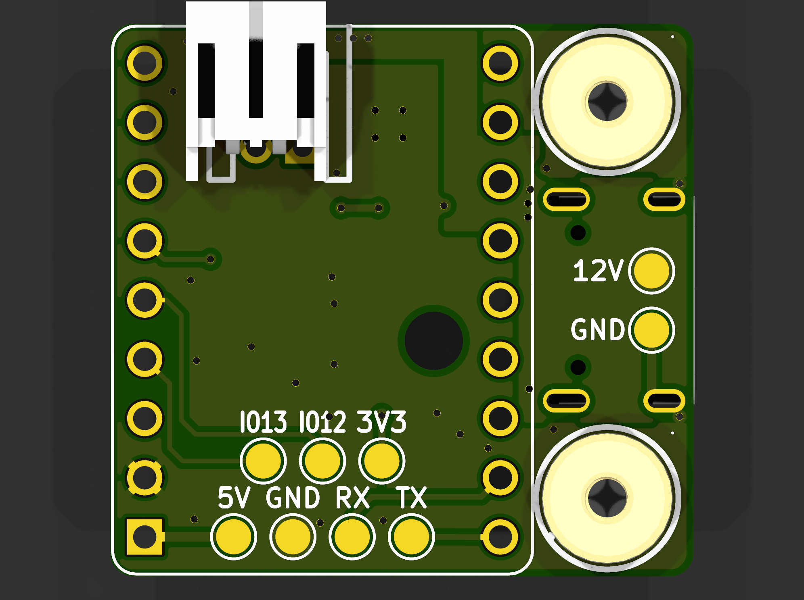
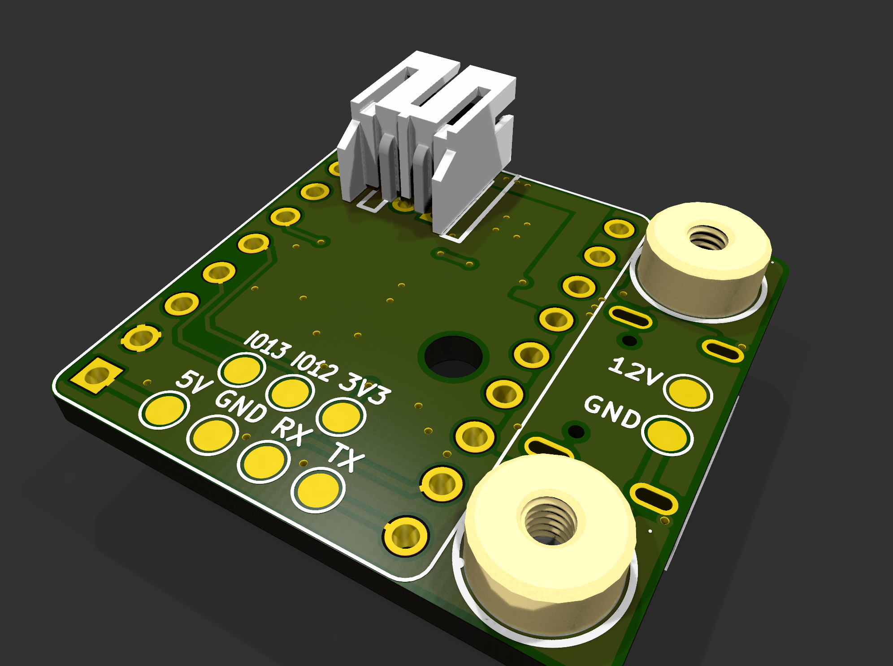
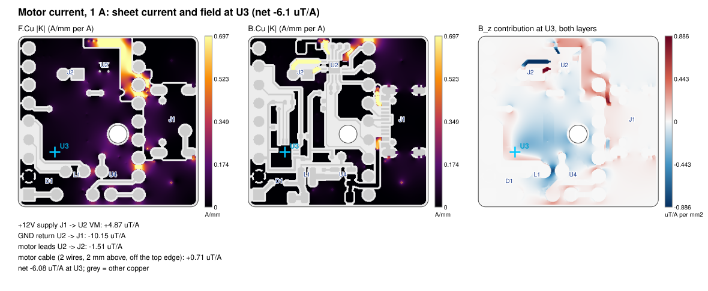
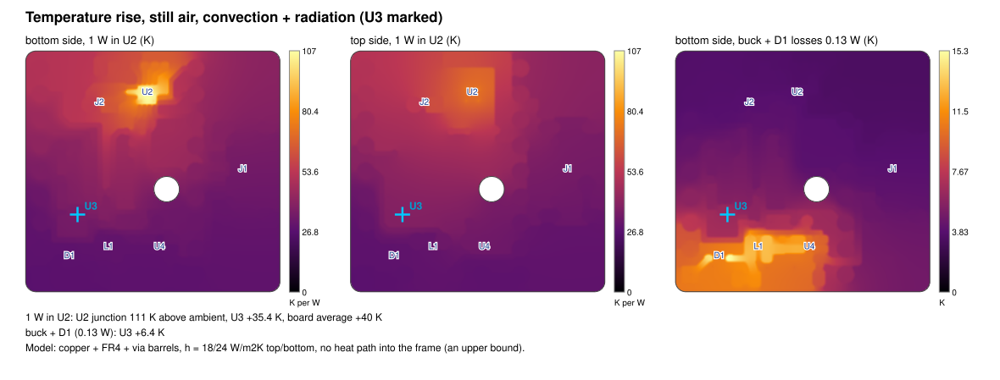
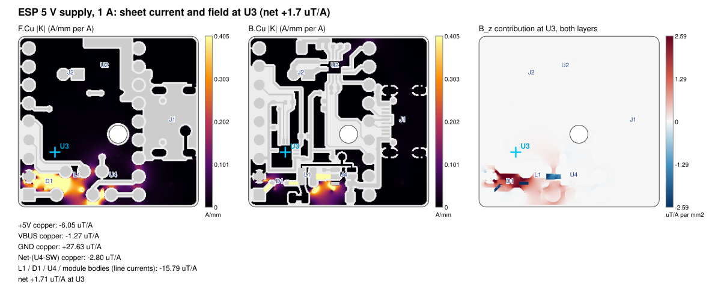

# PCBs

KiCad 10 projects for the lock-picking robot. This README covers the **main board** in [`main-board/`](main-board/). The splitter in [`splitter/`](splitter/) isn't documented here yet.

> **Naming.** The main board is the per-arm controller: one ESP32-S3, one motor driver and one magnetometer per arm. Its schematic title is "Lock Picking Robot - Arm Board", and the firmware calls it `arm`. The splitter's "main board" port feeds a different board, the motherboard.

## Contents

1. [At a glance](#at-a-glance)
2. [Production files](#production-files)
3. [3D renders](#3d-renders)
4. [File structure](#file-structure)
5. [Component choices](#component-choices)
6. [Layout decisions](#layout-decisions)
7. [Checks performed](#checks-performed)
8. [Issues that might arise](#issues-that-might-arise)
9. [Heat and current analysis](#heat-and-current-analysis)
10. [Cost](#cost)
11. [Scripts](#scripts)
12. [Working on the board in KiCad](#working-on-the-board-in-kicad)
13. [Revision history](#revision-history)

## At a glance

| | |
|---|---|
| Function | Drives one arm's brushed DC motor and measures the carriage position from a magnet |
| MCU | ESP32-S3 SuperMini module on 2 × 9-pin 2.54 mm sockets |
| Motor driver | TI DRV8876 (PH/EN, current sense, 2.2 A current limit) |
| Position sensor | Melexis MLX90393 3-axis magnetometer, centred over the carriage magnet |
| Power | 12 V from the splitter → AP63205 buck → 5 V → SuperMini (its own LDO makes 3.3 V) |
| Link to the motherboard | USB-C *connector* carrying 12 V and I²C (not USB) |
| Board | 25.0 × 23.7 mm, 2 layers, 1.6 mm FR4, 1 oz copper, 1 mm corner radius, Ø2.5 mm shaft hole |
| Assembly | Bottom side by JLCPCB (Economic PCBA); top side hand-soldered (SuperMini sockets, J2, M2 nuts) |
| Revision | v2, routing rev 3c (2026-10-04) |
| Status | DRC 0 errors, ERC 0 errors. **Update the firmware pin map before powering it** ([I1](#i1-firmware-pin-map-is-still-v1)) |

## Production files

All production files are generated by [`scripts/generate_production.py`](#scripts) into [`main-board/production/`](main-board/production/).

| File | Use |
|---|---|
| [Gerber + drill zip](main-board/production/Lock-Picking-Robot_v2_JLCPCB_gerbers.zip) | Upload to JLCPCB (11 files) |
| [BOM](main-board/production/Lock-Picking-Robot_v2_JLCPCB_BOM.csv) | JLCPCB assembly BOM: 22 parts on 17 lines, all with LCSC numbers |
| [CPL](main-board/production/Lock-Picking-Robot_v2_JLCPCB_CPL.csv) | JLCPCB pick-and-place (all bottom side) |
| [IPC-D-356 netlist](main-board/production/Lock-Picking-Robot_v2_netlist.ipc) | Optional upload, for JLC's electrical test |
| [STEP model](main-board/production/Lock-Picking-Robot_v2_3D.step) | Assembled board for CAD; every part except the SuperMini |
| [Component layout DXF](main-board/production/Lock-Picking-Robot_v2_component_layout.dxf) | Outline, mounting holes, ESP32 pins and non-passive courtyards; no text, for Onshape sketches |
| [DRC report](main-board/production/Lock-Picking-Robot_v2_DRC_report.txt) | Taken before each build |
| [Analysis numbers](main-board/production/Lock-Picking-Robot_v2_analysis.txt) and maps | See [Heat and current analysis](#heat-and-current-analysis) |
| [Manifest](main-board/production/Lock-Picking-Robot_v2_manifest.txt) | What the last build produced, plus its warnings |

The unzipped Gerbers (`production/*_gerbers/`) are generated alongside the zip and git-ignored.

### Ordering at JLCPCB

1. Upload the Gerber zip: 2 layers, 1.6 mm, HASL. ENIG is optional.
2. Choose **PCB Assembly → Economic → Bottom side**.
3. Upload the BOM and CPL. Check every part's pin 1 in JLC's placement preview, especially U2, U3, U4, D1 and J1.
4. JLC doesn't fit these; hand-solder them on the top side:
   - U1 (SuperMini + two 9-pin female headers);
   - J2 (JST S2B-PH-K-S, C173752);
   - H1/H2 (M2 SMD nuts SMTSOM225BTR, C5301773). Use a hot plate or hot air: they sit on solid GND.

## 3D renders

| Top | Bottom (JLC-assembled side) |
|---|---|
|  |  |



## File structure

```
PCB/
├── README.md                         this file: all main-board notes
├── splitter/                         splitter board (not covered here)
└── main-board/
    ├── main-board.kicad_pro          KiCad project (open this)
    ├── main-board.kicad_sch          schematic
    ├── main-board.kicad_pcb          board
    ├── main-board.kicad_dru          custom DRC rules (see Layout decisions)
    ├── fp-lib-table, sym-lib-table   point KiCad at libraries/
    ├── libraries/                    everything the project needs, bundled
    │   ├── main-board.kicad_sym      6 symbols: SuperMini, DRV8876, MLX90393, USB-C, JST-PH, M2 nut
    │   ├── main-board.pretty/        6 footprints (custom or edited)
    │   └── 3dmodels/                 4 STEP models: USB-C, JST-PH, M2 nut, MLX90393
    ├── mechanical/
    │   └── carriage-base.dxf         Onshape carriage sketch the board is placed against
    ├── scripts/
    │   ├── generate_production.py    builds everything in production/
    │   └── board_analysis.py         current / field / heat maps (run by the above)
    └── production/                   generated only: never edit by hand
```

Local, git-ignored: `*.kicad_prl` (per-user view settings), `*-backups/` and `.history/` (KiCad's own backups), `fp-info-cache`, lock files, `production/*_gerbers/` and `__pycache__/`. The ignore rules are in [`main-board/.gitignore`](main-board/.gitignore).

The project footprints:

| Footprint | Used by | Why it's custom |
|---|---|---|
| `ESP32-S3-SuperMini` | U1 | Module on 2.54 mm headers (pin 13 corrected onto the grid in rev 3c) |
| `QFN-16-1EP_3x3mm_P0.5mm_EP1.68x1.68mm_ThermalVias0.3` | U2 | DRV8876 RGT with 4 thermal vias and 5-window paste. Named `QFN-` so the JLC rotation correction applies |
| `VQFN-16_L3.0-W3.0-P0.50-BL-EP1.7` | U3 | EasyEDA land pattern for the MLX90393 |
| `USB-C_HX-TYPE-C-16PIN_NPTH-pegs` | J1 | HX 16-pin receptacle with its NPTH locating pegs |
| `CONN-TH_S2B-PH-K-S-LF-SN` | J2 | EasyEDA JST-PH side-entry connector |
| `M2_SMD_nut_SMTSOM225_ring4.2` | H1, H2 | M2 SMD nut, 4.2 mm plated ring and 3.7 mm hole |

## Component choices

### 12 V + I²C in: J1, USB-C used as a connector

- **Pins:** VBUS = +12 V, D+ = I2C_SDA, D− = I2C_SCL. Both D+/D− pairs are tied, so the plug works either way up.
- **Unused and shell:** CC and SBU are unused, so a plain USB-C cable passes VBUS, GND, D+ and D−. The shell tabs go to GND.
- **Pull-ups:** the I²C pull-ups live on the motherboard only, because all six arms share the bus.
- **Never** plug these ports into real USB devices ([I2](#i2-12-v-on-a-usb-c-connector)).
- **Probe pads:** TP8 (+12 V) and TP9 (GND) sit over J1 on the top side.

### Power: U4, L1, D1

- **U4, AP63205WU-7:** a 3.8–32 V in, fixed 5.0 V, 2 A, 1.1 MHz synchronous buck. EN is tied to VIN, so it starts automatically.
  - A buck loses about 0.05 W here, where a linear 12→5 V regulator would put about 0.5 W next to the magnetometer.
  - C1 (10 µF 25 V) is in, C3/C4 (2 × 47 µF 6.3 V) are out, C2 is bootstrap and L1 is 4.7 µH (FTC252012S).
- **D1, 1N5819WS:** joins the buck's +5 V to the SuperMini's 5 V pin (VBUS ≈ 4.6 V). It stops the SuperMini's own USB from back-feeding the buck while programming.
- **+3V3:** comes from the SuperMini's LDO and feeds U3, the pull-ups and the DRV8876 VREF.
- **Rail loads:** +12 V feeds U2 (motor ≤ 1.5 A) and U4 (about 40 mA in). +5 V feeds the SuperMini and TP6.

### Motor driver: U2, DRV8876RGTR

- **Mode:** PMODE is tied to GND, giving PH/EN mode (EN = PWM, PH = direction). IMODE is tied to GND, giving fixed off-time chopping with auto-retry on overcurrent.
- **Current sense:**
  - R1 = 1.5 kΩ 1 %, so I_TRIP = 3.3 V / (1000 µA/A × 1.5 kΩ) = 2.2 A and IPROPI reads 1.5 V/A.
  - C12 (10 nF) stops motor transients tripping the limit early and smooths the ADC.
- **Decoupling and charge pump:** C5 (100 nF 50 V) and C6 (22 µF 25 V) sit right at VM/PGND. C7 (100 nF) is on VCP and C8 (22 nF) on CPH–CPL.
- **nFAULT:** pulled up to 3.3 V with 10 kΩ (R2).
- **Motor connector:** J2 pin 1 = OUT1, pin 2 = OUT2, a short side-by-side pair with a tiny loop.

### Magnetometer: U3, MLX90393SLW-ABA-011-RE

- **Interface:** I²C mode (CS high), A0 = A1 = GND, giving address 0x0C. INT goes to MAG_INT (data ready); INT/TRIG is left open.
- **Placement:** the Hall plates are at the package centre, so U3 is centred over the carriage magnet.
- **Decoupling:** C10 (100 nF, 1.0 mm from pin 8), C9 (100 nF, next to pins 2/15) and C11 (10 µF bulk).
- **Pull-ups:** R3/R4 are 2.2 kΩ on the local MAG I²C bus.

### MCU: U1, ESP32-S3 SuperMini on sockets

- **Mounting:** sits on 2.54 mm female headers on the top side, with its own USB-C at the board edge for programming.
- **Pin choice:** pins are picked so each block routes on one layer without crossings.

| SuperMini pin | Net | Use |
|---|---|---|
| GPIO1 | DRV_IPROPI | Motor current (ADC1_CH0, works with Wi-Fi on), 1.5 V/A |
| GPIO2 | DRV_nFAULT | Driver fault input (10 k pull-up) |
| GPIO3 / GPIO4 | I2C_SDA / I2C_SCL | Bus to the motherboard via J1 (GPIO3 strapping only matters if the eFuse is burnt) |
| GPIO5 | DRV_nSLEEP | Drive **high** to run |
| GPIO6 | DRV_IN2_PH | Direction |
| GPIO7 | DRV_IN1_EN | PWM |
| GPIO8 | — | Free |
| GPIO9 / GPIO10 / GPIO11 | MAG_SDA / MAG_SCL / MAG_INT | Magnetometer |
| GPIO12 / GPIO13 | EXP_IO12 / EXP_IO13 | Spare, on pads TP1/TP2 |
| TX / RX (GPIO43/44) | EXP_TX / EXP_RX | On pads TP3/TP4. TX prints the ROM boot log at reset |
| 5V / 3V3 / GND | VBUS / +3V3 / GND | VBUS ≈ 4.6 V after D1 |

GPIOs are 3.3 V only: they are **not** 5 V tolerant.

### Test and wire pads

| Pads | Side | Nets | Notes |
|---|---|---|---|
| TP1–TP7 | Top, 1.5 mm | IO12, IO13, TX, RX, 3V3, 5V (VBUS), GND | Labelled on the silk. Glue wires down so the pads don't lift |
| TP8, TP9 | Top, over J1 | +12 V, GND | Supply health and motor droop, reachable with the robot assembled |
| TP10, TP11 | Bottom | +5 V (buck output, before D1), GND | On the buck's feedback line between U3 and U4 |

### Mechanical parts and passives

- **H1/H2:** SMTSOM225BTR M2 SMD nuts. They are tin-plated copper, so non-magnetic and fine near U3.
- **J2:** JST S2B-PH-K-S, side entry; its body overhangs the top edge by design.
- **Passives:** all are JLC **Basic** parts, so there are no feeder fees.
- **Capacitor derating** at working voltage:

| Cap | Rating | Working voltage | Effective value |
|---|---|---|---|
| C6 | 22 µF / 25 V | 12 V | ≈ 9 µF |
| C1 | 10 µF / 25 V | 12 V | ≈ 3.5 µF |
| C3, C4 | 47 µF / 6.3 V | 5 V | ≈ 10 µF each |
| C11 | 10 µF / 6.3 V | 3.3 V | ≈ 3 µF |

## Layout decisions

- **Sides.**
  - **Bottom:** every JLC-assembled part and most signals.
  - **Top:** the hand-fitted parts, a GND pour, a 12 V copper area and short hops.
  - Bottom parts stay ≥ 0.9 mm from the U1/J2 through-hole pins so those can be hand-soldered. J1's 12 V pads are 0.98 mm from ESP pins 2 and 4: solder those carefully.
- **12 V path.** J1's top VBUS pad → 3 vias → the front 12 V copper (through the gaps between ESP pins 6/5 and 5/4) → inside the right header → along the top edge → 3 vias → C5/C7/U2 VM. The narrowest point is about 1 mm. J1's bottom VBUS pad feeds the buck on the back.
- **Motor loop.**
  - OUT1/OUT2 run to J2 in 0.6 mm tracks under 3 mm long.
  - The return goes through U2's 4 thermal vias into the front GND, right under the 12 V feed.
- **Magnetometer.** U3 is centred on the magnet. The MAG I²C lines run on the back over unbroken front GND, ≥ 1.2 mm from J2 and the motor copper.
- **Distances from U3's centre (rev 3c):**

| To | Distance |
|---|---|
| J2 pins | 10.9 mm |
| MOT_OUT copper | 10.2 mm |
| U2 | 13.6 mm |
| +12 V copper | 9.1 mm |
| U4 | 8.7 mm |
| L1 | 4.6 mm |
| D1 | 4.4 mm |
| SW node | 4.1 mm |

- **Zones.** GND pours sit on both layers, plus a +12 V island on F.Cu. SMD pads join the pours by tracks only (`thru_hole_only`), which prevents 0402 tombstoning. Zone clearance is 0.25 mm and the minimum width is 0.2 mm.
- **Rules.** The default net class is 0.2 mm track and 0.2 mm clearance. Vias are 0.6/0.3 mm (some 0.5/0.3). `main-board.kicad_dru` adds:
  - U1 sits on sockets, so parts may sit under its courtyard;
  - TP courtyards may overlap (2.54 mm grid);
  - copper to the board edge and the shaft hole is 0.3 mm (JLC's routed-edge minimum);
  - J1's peg holes may sit 0.15 mm from its own pads (vendor land pattern).
- **Carriage fit (rev 3c).** U3 and the Ø2.5 mm shaft hole were moved 3.5 mm in +y. Both still sit over the carriage's magnet and top-right holes, while the board edge moves 3.5 mm away from the carriage shaft:

| Check (from `mechanical/carriage-base.dxf`) | Result |
|---|---|
| Carriage rotation relative to the board | 15.9° |
| Board edge to shaft centre | 4.32 mm |
| Clearance from the Ø6.9 mm shaft hole | 0.87 mm |
| Overlap with the R5 boss | 0.68 mm |

- **rev 3c re-route.**
  - +3V3 now runs left of and under U3, between U3 and the buck, to pin 8, then up x = 20.6 to R2 and across to the TP5 via.
  - DRV_IPROPI passes under the shaft hole.
  - DRV_nFAULT passes over the hole and down the single-track gap to ESP pin 2.
  - The buck's +5 V feedback line moved 0.25 mm down to clear C10.

## Checks performed

All checks were last run on rev 3c (2026-10-04).

| # | Check | Result | Status |
|---|---|---|---|
| 1 | KiCad DRC, custom rules, all track errors | 0 errors, 0 unconnected, 0 schematic-parity issues; 15 silkscreen warnings | OK |
| 2 | KiCad ERC | 0 errors; 46 "Unspecified pin type" warnings from the EasyEDA symbols | OK |
| 3 | Copper clearance (independent re-measure) | ≥ 0.200 mm (rule 0.2, JLC 0.127) | OK |
| 4 | Copper to edge and shaft hole | ≥ 0.300 mm | OK |
| 5 | Hole-to-hole spacing (slots exact) | ≥ 0.275 mm (JLC 0.254) | OK |
| 6 | Tracks, vias, annular rings | Tracks ≥ 0.2 mm; vias 0.3 mm drill with ≥ 0.1 mm ring | OK |
| 7 | Acid traps, duplicate or dangling tracks | None | OK |
| 8 | ESP32 socket pin grid | All 18 holes on 2.54 mm | OK |
| 9 | MAG I²C over unbroken front GND | Only the pin and via ends are uncovered | OK |
| 10 | MAG lines to motor copper | 1.21 mm (needs ≥ 1.2) | OK |
| 11 | Crosstalk (parallel runs ≤ 1 mm apart) | Only I²C lines next to each other or +3V3 | OK |
| 12 | Power-path resistance / current density | +12 V 9.1 mΩ, GND 2.1 mΩ; peak 4.8 A/mm per A on the short U2 VM stub | OK |
| 13 | ESP 5 V loop field at U3 | 1.7 µT/A | OK |
| 14 | Decoupling at U3 | C10 1.0 mm from pin 8, C9 2.4 mm from pin 2 | OK |
| 15 | Hand-solder clearance to U1/J2 pins | 0.91 mm | OK |
| 16 | Production files vs board | Gerbers, drills, CPL, BOM, netlist and DXF all match | OK |
| 17 | BOM sourcing | 22 parts, all with LCSC numbers; single-sided assembly | OK |
| 18 | Libraries | All bundled in `libraries/`; no missing-library or mismatch warnings | OK |
| 19 | Motor-current field at U3 | 6.1 µT/A ([details](#motor-current-field-at-the-magnetometer)) | Warning |
| 20 | Carriage fit: shaft boss, screws, alignment | See [W1–W3](#warnings) | Warning |
| 21 | STEP completeness | Every part except U1 (no SuperMini model) | Warning |
| 22 | Silkscreen | J1/J2 overhang the edge; EasyEDA silk lines 0.06 mm; text 0.8 mm | Warning |
| 23 | Firmware pin map | Still v1 | **Issue** |
| 24 | 12 V on a USB-C connector | Hazard to real USB devices | **Issue** |
| 25 | Heat reaching U3 | +35.4 K per W in U2 | **Issue** (accuracy) |
| 26 | U2 at 1 A continuous | Reaches thermal shutdown in still air | **Issue** |

## Issues that might arise

### I1. Firmware pin map is still v1

`firmware/common/config.h` still has the v1 pins (`MAG_SDA/SCL 41/40`, `COMMS 21/22`, `PIN_CS 4`, `IN1_EN 5`, `MODE_PIN 7`, `CURRENT_SENSE_V_PER_A 2.5`). On this board that goes wrong in four ways:

- `magnet.begin()` never returns, because the SuperMini doesn't break out 41/40;
- PWM goes to nSLEEP;
- driving "MODE" low holds the bridge in brake;
- current sensing reads I2C_SCL.

**Fix:** use the [pin map above](#mcu-u1-esp32-s3-supermini-on-sockets) and 1.5 V/A before the first power-up.

### I2. 12 V on a USB-C connector

J1 always carries 12 V on VBUS, right next to the SuperMini's real USB-C port. One wrong plug destroys the module, or anything else plugged into a motherboard port.

**Fix:**
- **Now:** label "12 V – NOT USB" and use a coloured cable.
- **Next spin:** a non-USB connector (JST-GH, Molex Pico-Lock), or CC-ID gating, where the motherboard switches 12 V on only when it sees this board's CC resistor.

### I3. Heat reaching the magnetometer

U3 rises 35.4 K per watt dissipated in U2, plus about 6.4 K from the buck and D1. The board takes about 100 s to warm up, so what matters is the motor's average power:

| Motor use | U2 power | U3 rise (steady state) |
|---|---|---|
| 0.5 A for 10 % of the time | ≈ 0.024 W | < 1 K |
| 0.5 A continuous | 0.24 W | ≈ 8.5 K |
| 1.0 A continuous | ≈ 1.1 W | ≈ 39 K (and U2 hits TSD, see I4) |

The firmware currently divides the field by a magnet tempco based on U3's *die* temperature, but the magnet doesn't see the board's heat. That adds about 1.2 % of B per +10 K: roughly 27, 41 and 58 µm at 2.5, 6 and 10.5 mm of travel.

**Fixes:**
- **Firmware (free):**
  - stop applying the magnet tempco from the die temperature;
  - enable `TCMP_EN`;
  - re-zero against an end stop now and then.
- **Hardware:** add a heat sink.

| Option | U2 junction per W | U3 per W in U2 |
|---|---|---|
| None (as built) | 111 K | 35.4 K |
| ~40 K/W stick-on sink, top side over U2 (≈ 6 × 8 mm, between J2 and the right-hand ESP pins, on a thermal pad over U2's vias; must fit under the SuperMini) | 77 K | 15.4 K |
| ~20 K/W sink, same place | 69 K | 10.7 K |
| Small sink glued on U2's package (bottom side, if the carriage leaves room) | 50–56 K | 16–18 K |
| H1/H2 screwed into a metal frame (~10 K/W each) | 93 K | 22 K |

### I4. U2 at high continuous current

The DRV8876 junction runs at 111 K/W in still air (150 K/W with convection only). At 1 A continuous, U2 dissipates about 1.1 W, so the junction reaches ≈ 145–160 °C, at its thermal-shutdown threshold. 1.5 A trips shutdown within seconds; the driver recovers by itself and pulls nFAULT low.

**Fix:**
- limit continuous current or duty, and read nFAULT (GPIO2);
- a heat sink (I3) makes 1 A continuous safe;
- on the next spin, the DRV8874PWPR has 3.5× lower loss.

### Motor-current field at the magnetometer

The motor current's own copper creates 6.1 µT per amp at U3's Hall plate. That's up from 3.5 µT/A in rev 3b, because U3 now sits nearer the front-GND return path; the shaft hole only accounts for 0.1 µT/A of it. The error only exists while current flows. At the target, where precision matters, the controller's current is close to zero.

| Motor current | Error at 2.5 mm travel | at 6 mm | at 10.5 mm |
|---|---|---|---|
| 0.3 A | 0.3 µm | 1.4 µm | 6 µm |
| 1.0 A | 0.9 µm | 4.6 µm | 20 µm |
| 1.5 A | 1.3 µm | 6.9 µm | 30 µm |

The firmware deadband is 10 µm.

**Fix if needed:**
- compensate in firmware, since the error is linear in current: B_corr = B_z − k·I_motor, with k calibrated with the magnet removed;
- or brake the motor during the ~25 ms conversion near the target;
- next spin: run a GND strip directly under the 12 V feed.

### Warnings

| # | Warning | What to do |
|---|---|---|
| W1 | **Shaft boss.** The board edge clears the Ø6.9 mm shaft hole by 0.87 mm but overlaps the R5 boss by 0.68 mm in plan view | Confirm in CAD that the boss doesn't reach the PCB plane |
| W2 | **Mounting screws.** The board, including H1/H2, moved 3.5 mm relative to the carriage in rev 3c | Move the carriage's screw holes; use the new DXF |
| W3 | **Magnet alignment.** U3 is 9.114 mm from the shaft hole, but the carriage's magnet is 9.000 mm from its hole | U3 sits within 0.11 mm of the magnet centre; calibrate in place |
| W4 | **Bottom side faces the carriage.** That includes the TP10/TP11 wire pads; TP10 is 1.5 mm from the hole edge | Make sure the carriage has pockets for the parts and room for wires |
| W5 | **No SuperMini 3D model** | Add an ESP32-S3 SuperMini STEP to `libraries/3dmodels/` and assign it to U1 |
| W6 | **Silkscreen.** 15 DRC warnings: J1/J2 deliberately overhang the edge, some silk sits over pads, U1 overlaps J2/H2. EasyEDA silk lines are 0.06 mm (JLC minimum 0.153); text is 0.8 mm (JLC recommends 1.0) | Cosmetic only |
| W7 | **No TVS on 12 V,** and ceramic-only bulk (about 12 µF effective): PWM ripple flows in the cable, and a hot-plug can overshoot towards 24 V against 25 V caps | Next spin: 47–100 µF polymer + SMAJ15A at J1; run PWM at 20–25 kHz |
| W8 | **Motherboard I²C over the USB-C cable,** with no ESD protection or series R; SDA and SCL are coupled in the twisted pair | ≤ 100 kHz; next spin: TVS + 33–100 Ω series R, or CAN/RS-485 |
| W9 | **J1 peg holes** are 0.18 mm from its pads (vendor pattern) | JLC may query it; accept |
| W10 | **Background field.** The firmware uses \|B_z\|, so re-orienting the robot after calibration shifts readings by up to ±50 µT | Calibrate in the working orientation; subtract a parked-magnet baseline |

## Heat and current analysis

[`scripts/board_analysis.py`](main-board/scripts/board_analysis.py) produces these maps on every build.







**Method:**
- **Copper:** both layers (tracks, pads, vias and the stored zone fills) are rasterised on a 0.08 mm grid.
- **Current:** each current path is solved with its source pads at 1 V and its sink pads at 0 V, then scaled to 1 A.
- **Field:** a Biot–Savart sum gives B_z at U3's Hall plate, 0.5 mm below the bottom copper. Motor leads and the cable (two wires, 2 mm above, leaving the top edge) are included. In `analysis.txt`, + means towards the top face, and the sign flips with motor direction.
- **Heat:** a steady-state network of copper (35 µm, 385 W/mK), FR4 (1.6 mm, 0.3 W/mK) and via barrels (20 µm plating). It assumes still air and no heat path into the frame, so it is an upper bound. Losses into the air use h = 18/24 W/m²K top/bottom (10/12 for convection only), and RθJC(bot) of U2 is 7.1 K/W.
- **Validation:** run on rev 3b, the model reproduces the original review: U2 112 vs 117 K/W, U3 38.5 vs 39 K/W, motor loop 3.5 vs 3.4 µT/A.

| Result (rev 3c) | Value |
|---|---|
| Motor loop at U3, net (12 V copper / GND return / motor leads / cable) | 6.1 µT/A (+4.9 / −10.2 / −1.5 / +0.7) |
| ESP 5 V loop at U3 | 1.7 µT/A (near-cancellation of large terms; model-sensitive) |
| 12 V / GND path resistance | 9.1 / 2.1 mΩ |
| U2 junction, U3, board average per W in U2 | 111 / 35.4 / 40 K |
| U3 from buck + D1 losses (0.13 W) | 6.4 K |

## Cost

These are JLCPCB estimates from 2026-10-03, using live part prices and JLC's published fees, excluding shipping and tax. The order is 2-layer FR4, 1.6 mm, green, HASL, with Economic PCBA on the bottom side.

| Assembled / PCBs | PCB | Setup | Stencil | Extended-part feeders | SMT joints | Parts | **Total** | **Per board** |
|---|---|---|---|---|---|---|---|---|
| 2 / 5 | $2.00 | $8.18 | $1.53 | $15.35 | $0.29 | $13.84 | **≈ $41** | $20.60 |
| 5 / 5 | $2.00 | $8.18 | $1.53 | $15.35 | $0.74 | $28.17 | **≈ $56** | $11.19 |
| 10 / 10 | ≈ $5 | $8.18 | $1.53 | $15.35 | $1.47 | $45.35 | **≈ $77** | $7.69 |
| 20 / 20 | ≈ $9 | $8.18 | $1.53 | $15.35 | $2.94 | $87.77 | **≈ $125** | $6.24 |
| 50 / 50 | ≈ $17 | $8.18 | $1.53 | $15.35 | $7.36 | $191.15 | **≈ $241** | $4.81 |

- **Parts:** about $4.90 per board at 1–9 pcs; U3 (≈ 50 %) and U2 (≈ 28 %) dominate.
- **Feeder fees:** five Extended parts (U2, U3, U4, J1, L1) cost $3.07 each per order, whatever the quantity.
- **Hand-fitted, not from JLC:** SuperMini + headers (≈ $4–6), J2 (≈ $0.06) and 2 × M2 nuts ($0.08 each; can be added to the JLC order as loose parts).
- **Optional extras:** ENIG ≈ +$15–20, QFN X-ray ≈ $1.6/board, shipping $3–25.
- **Cheaper:**
  - panelise (2 × 2) for 10+ boards;
  - check JLC's "Preferred Extended" list before ordering (no feeder fee);
  - J1 and L1 have Basic-library alternatives if the package can change.

## Scripts

Both scripts need only the Python standard library and **KiCad 10**: `kicad-cli` on the PATH, or the `org.kicad.KiCad` flatpak. The analysis runs in KiCad's own Python, which brings pcbnew and numpy.

### `generate_production.py`

```bash
cd PCB/main-board
python3 scripts/generate_production.py              # asks which outputs (Enter = all)
python3 scripts/generate_production.py --all        # everything, no questions
python3 scripts/generate_production.py --only jlc   # gerbers, bom, cpl, netlist
python3 scripts/generate_production.py --only dxf,analysis --skip-drc
```

| Option | Effect |
|---|---|
| `--all` / `--only a,b` | Pick outputs: `gerbers`, `bom`, `cpl`, `netlist`, `step`, `render`, `dxf`, `analysis`, or the groups `all` and `jlc` |
| `--clean` | Delete earlier outputs of this board first (files starting with the output prefix only) |
| `--skip-drc` / `--ignore-drc` | Skip the DRC pre-flight, or build even if it fails |
| `--board`, `--out` | Default to `main-board.kicad_pcb` and `production/` |

Behaviour:

- **DRC pre-flight:** a DRC with schematic parity runs first. Any error, unconnected item or parity issue stops the build.
- **Output names:** `<title>_<rev>_…`, taken from the board's title block (`Lock-Picking-Robot_v2_…`). `…_manifest.txt` lists what was made and any warnings.
- **BOM/CPL:** these follow the Fabrication Toolkit plugin.
  - Placement is at the footprint anchor (SMD) or the pad centre (THT), with Y negated.
  - Bottom-side rotation is 180° minus the rotation, then the plugin's per-footprint corrections. Its `transformations.csv` is read when the plugin is installed; otherwise a built-in copy is used.
  - An optional `FT Rotation Offset` field adds to that.
  - Parts marked "exclude from BOM/position files" (U1, J2, H1, H2, TPs) are left out.
- **DXF:** written directly from the board as R12 LINE/ARC/CIRCLE entities in mm (Y up), on the layers Edge.Cuts, F.Courtyard and B.Courtyard.
  - Passives (R, C, L, FB) are left out.
  - Mounting holes are drawn as drill circles and the ESP32 pins as drill holes.
  - Arc ends meet their lines exactly, so Onshape sees closed regions.
- **analysis:** runs `board_analysis.py` (about 1 minute) and writes `…_current_motor.svg`, `…_current_5V.svg`, `…_thermal.svg` and `…_analysis.txt`.

### `board_analysis.py`

The production script runs this as its `analysis` output; it can also run on its own in KiCad's Python:

```bash
flatpak run --filesystem="$PWD" --command=python3 org.kicad.KiCad \
    scripts/board_analysis.py main-board.kicad_pcb production/Lock-Picking-Robot_v2
```

The paths it solves, the heat sources and the physical constants are named at the top of the script (`MOTOR`, `SUPPLY`, `HEAT_U2`, `HEAT_BUCK`, `GRID`, `H_RAD`, …).

## Working on the board in KiCad

- **Opening:** open `main-board/main-board.kicad_pro`. All symbols, footprints and 3D models resolve from `libraries/` through `${KIPRJMOD}`, so no global libraries are needed.
- **Refilling zones:** refill with **B** in the board editor, or with `kicad-cli pcb drc --refill-zones --save-board`.
  - The kicad-cli route also rewrites `main-board.kicad_pro` and `.kicad_prl`, so restore them with `git checkout` afterwards.
  - Don't refill from pcbnew Python: `ZONE_FILLER` ignores the custom rules and fills with 0.5 mm edge clearance.
- **Editing library parts:** edit the project library parts, then run "Update footprints from library". The board's copies currently match the library exactly.
- **Order of work:** change the schematic, then update the PCB from it, then run DRC. Finally run `scripts/generate_production.py --all` and commit the `production/` changes with the board.

## Revision history

| Rev | Date | Changes |
|---|---|---|
| v2 rev 3b | 2026-10-03 | Full design review; test pads TP8–TP11 added |
| v2 rev 3c | 2026-10-04 | Re-route and fixes, below |
| — | 2026-10-04 | Project restructure, below |

**rev 3c changes:**
- U3 and the shaft hole moved 3.5 mm for carriage-shaft clearance, then the area was re-routed. TP10/TP11 moved onto the buck's feedback line.
- ESP32 pin 13 put onto the 2.54 mm grid.
- Two GND vias at J1's shell slots moved to give 0.275 mm hole spacing.
- U2's 3D model fixed.
- Heat and current maps added to the production script.

**Project restructure:**
- Renamed to `main-board`, with libraries and 3D models bundled.
- Scripts moved to `scripts/` and the carriage DXF to `mechanical/`.
- Notes merged into this README.
- Stale backups and duplicate files removed.
- The earlier `design-review/` documents are in git history (commit `bc676de`).
