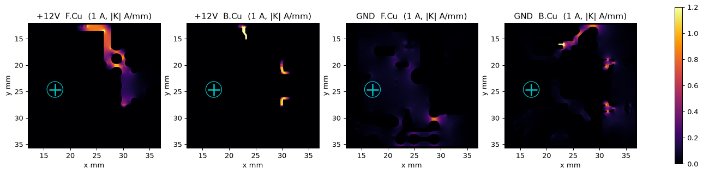
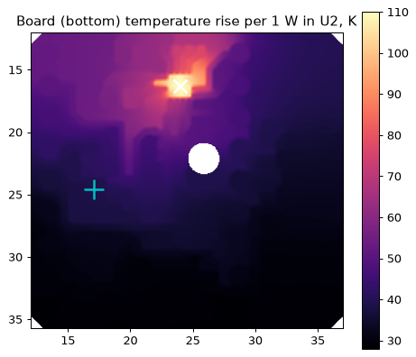
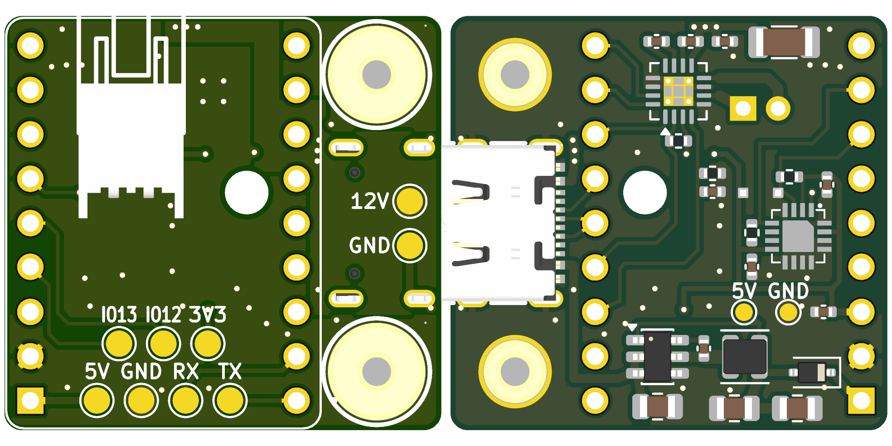

# Arm board v2 — PCB design review

**Board:** Lock Picking Robot arm board, rev v2 (routing rev 3b + test pads TP8–TP11), 25.0 × 23.7 mm, 2-layer, 1.6 mm, 1 oz
**Date:** 2026-10-03
**Scope:** `PCB/lock-picking.kicad_pcb`, `lock-picking.kicad_sch`, custom footprints, `firmware/common/*.h` where it touches the hardware
**Status:** review only. None of the issues below have been fixed; the only board change in this pass is the four new test pads (see Appendix B).

### How it was checked

- KiCad 10 DRC with schematic parity: **0 errors, 0 unconnected, 0 parity issues**, 15 silkscreen warnings. ERC: 46 warnings, all EasyEDA "Unspecified pin type"; no real connection errors.
- Pinouts checked against the datasheets: DRV8876 (TI SLVSDS7B, RGT column), MLX90393 (Melexis rev 012, QFN-16 table and Fig. 24), and AP63205 (TSOT-26).
- **DC current-flow solve on the real copper.** Both layers, zone fills, vias and thermal vias were rasterised at 0.08 mm and solved for the motor supply path (+12 V) and its return (GND). A Biot–Savart integral then gave the field at the MLX90393's Hall plate.
- **Steady-state thermal network** on the same copper: FR4 plus vias, convection and radiation on both faces, still air, and no heat path into the frame. This is a worst case.
- Coupled-length scan for crosstalk between every noisy net and every sensitive net.
- Live JLCPCB library data for parts, stock and Basic/Extended status (see `JLCPCB_Cost_Estimate.md`).

### Severity scale

| Level | Meaning |
|---|---|
| **HIGH** | Stops the board working, can destroy something, or is the dominant accuracy limit |
| **MED** | Real degradation or risk under plausible conditions |
| **LOW** | Best practice, margin or cosmetic |
| INFO | Checked and fine, or just context |

---

## 1. Summary

The layout is careful. The PCBA parts are all on one side, which keeps assembly cheap. The power stages are compact, and the magnetometer was clearly placed with the noise sources in mind. On-board crosstalk is essentially nil.

The problems that matter are mostly not trace-level:

| # | Sev | Issue | One-line fix |
|---|---|---|---|
| F1 | **HIGH** | The firmware pin map is still v1. The magnetometer is on GPIO41/40, which the SuperMini doesn't break out, so `magnet.begin()` loops forever. PWM goes to GPIO5, which is now nSLEEP. EN (GPIO7) is held low. The current ADC reads GPIO4, which is now I2C_SCL. | Update `config.h` (§4, F1) |
| T1 | **HIGH** | Board heat reaches the magnetometer. U3 rises about 39 K per watt dissipated in U2. The firmware treats the sensor die temperature as the magnet temperature. At full travel this adds roughly 60–160 µm per 10 K, which is 20–50× more than the magnetic pickup from traces. | Firmware compensation fix now; lower-loss driver and/or thermal slot later (§3.2) |
| U1 | **HIGH** | Two USB-C receptacles sit side by side, and J1 carries an always-on 12 V on VBUS. Plugging the 12 V cable into the SuperMini's USB-C puts 12 V on its 5 V rail. | Non-USB connector, or CC-ID gating + silkscreen (§4, U1) |
| T2 | MED-HIGH | U2 runs at about 117 K/W junction-to-ambient on this board. 1 A continuous gives Tj ≈ 150–165 °C, which is at thermal shutdown. 1.5 A trips TSD within tens of seconds. | DRV8874PWPR (3.5× lower loss), lower ITRIP, duty limits (§3.2) |
| P1 | MED | The 12 V rail has only ceramic bulk, about 12 µF effective after DC bias. As a result, (a) the 10 kHz PWM ripple current flows through the USB-C cable, (b) a hot-plug can overshoot towards 24 V against 25 V caps, and (c) there is no TVS. | 47–100 µF polymer/electrolytic + SMAJ15A at J1, PWM to 20–25 kHz (§3.3) |
| X1 | MED | The motherboard I²C runs over the USB-C D+/D− twisted pair. SDA and SCL are tightly coupled there, the motor return current shares the cable GND, there is no ESD protection or series resistors, and nothing pulls the bus up when it is unplugged. | ≤100 kHz, 33–100 Ω series + TVS at J1, weak pull-ups; or CAN/RS-485 (§3.4) |
| M1 | MED | The motor loop field at U3 is +3.4 µT per amp. At 1.5 A that is about 17 µm at 10.5 mm travel, above the firmware's 10 µm deadband. The ESP supply loop adds −8.8 µT per amp of ESP current. | Firmware: compensate (field ∝ current) or brake during conversions. Layout: run the return under the 12 V feed (§3.1) |
| M2 | MED | Static or background fields are not removed. The firmware uses \|Bz\| only, so re-orienting the robot after calibration shifts the reading by up to ±50 µT (≈160 µm at full travel). | Calibrate in place and subtract a background (§3.1) |

Everything else is LOW or INFO (§4).

---

## 2. Top 20 PCB design mistakes, checked against this board

| # | Common mistake | This board | Sev | Ref |
|---|---|---|---|---|
| 1 | Wrong footprint or pinout (symbol ↔ footprint ↔ datasheet) | DRV8876 RGT, MLX90393 QFN-16, AP63205, D1 polarity and J1 all match their datasheets. One small slip: SuperMini footprint pin 13 is at y = −2.50 mm instead of −2.54 mm. | LOW | L2 |
| 2 | Undersized traces or vias for the current | 12 V path drop is 10.8 mΩ and GND return 4.7 mΩ. The narrowest points are short pin stubs (peak 2.9 A/mm per amp), which are OK at ≤1.5 A. | LOW | L16 |
| 3 | Decoupling missing, too far away, or no bulk | The 0.1 µF caps on VM, VCP and CPH–CPL are right at U2. Bulk on the 12 V rail is small. | MED | P1 |
| 4 | Broken ground plane or long return paths | The front 12 V island splits the front GND. The motor return detours along the bottom edge (F.Cu) and the top edge (B.Cu), and passes through 0.54 mm necks between ESP pins. | LOW / MED | M1, L15 |
| 5 | Switching-regulator layout (hot loop, SW node, FB) | The C1–U4 loop is about 4.6 mm². The SW node is small and on one layer. FB is taken at L1 rather than at C3/C4. | LOW | L8, L9 |
| 6 | Thermal design of power parts | U2 is marginal at 1 A continuous, and its heat reaches U3. | MED-HIGH | T1, T2 |
| 7 | Sensitive sensor near noise, magnetics or heat | The magnetic pickup is small (µT). Heat and background fields dominate. | HIGH | T1, M1, M2 |
| 8 | Crosstalk between parallel aggressors and victims | On the board, no aggressor runs within 1 mm of a victim on the same layer. The MAG lines are ≥1.2 mm from motor copper. The only significant coupling is in the cable. | MED (cable) | X1 |
| 9 | No ESD or transient protection on external connectors | J1 has 12 V, SDA and SCL with no TVS or series R. | MED | P1, X1 |
| 10 | No input protection (reverse polarity, OV, OC, misuse) | USB-C makes reverse polarity impossible. There is no OV or hot-plug clamp, and connector mix-up is a real risk. | HIGH / MED | U1, P1 |
| 11 | Capacitor voltage rating or DC-bias derating ignored | C6 is about 9 µF at 12 V, C1 about 3.5 µF, C3/C4 about 10 µF each at 5 V, and C11 about 3 µF. | MED / LOW | P1, L10 |
| 12 | DFM: clearance, annular ring, copper-to-edge, slivers | DRC is clean. Copper-to-edge is 0.3 mm (at JLC's minimum). J1 peg holes are 0.18 mm from the pads. The U2 EP has open vias. | LOW | L5–L7 |
| 13 | Assembly: rotation, polarity, fiducials, tombstoning, sides | Single-sided (bottom). No fiducials, which Economic PCBA doesn't need. SMD pads use traces rather than pour, which prevents tombstoning. Rotations need checking in JLC's preview, and the SMD nuts are to be hand-soldered. | MED / LOW | A1, A2 |
| 14 | No test points or debug access | Previously only wire pads under the module. **Fixed in this pass:** TP8–TP11. | — | App. B |
| 15 | Mechanical: overhang, 3D clearance, missing models | J2 sits under the SuperMini. U1 has no 3D model and U2's model file is missing, so the STEP can't prove clearance. | MED | A3, L1 |
| 16 | RF antenna keep-out | The SuperMini's antenna end sits over J2, the motor cable and 12 V copper (about 8.5 mm below). | LOW-MED | A4 |
| 17 | Silkscreen over pads or off-board, missing labels | J1/J2 silk is clipped (15 warnings). Labelling is otherwise good. | LOW | L4 |
| 18 | Floating inputs and strapping pins | DRV inputs have internal pulldowns, and GPIO3's strap is harmless. MLX INT/TRIG floats (allowed). The motherboard I²C floats when unplugged. | LOW | L11, X1 |
| 19 | Schematic / PCB / firmware mismatch | Schematic↔PCB parity is clean. Firmware↔PCB is wrong. | HIGH | F1 |
| 20 | BOM and sourcing | Everything is in stock. There are 5 Extended parts (about $15 in feeder fees). U2 (1,978 in stock) and U3 (2,316) are fine for prototypes. | INFO | cost file |

---

## 3. Deep dives

### 3.1 Magnetometer: magnetic pickup (EMF) from the board

**Method.** The DC current distribution was solved for 1 A drawn by U2. It enters at J1's VBUS pads, flows through the +12 V copper (F.Cu island plus B.Cu feeds) to U2 VM, and returns from U2 PGND through the GND pours and vias to J1's GND pads. B_z was then integrated at U3's Hall plate, taken as 0.5 mm below the board's bottom face. The motor leads U2→J2 and a 2-wire cable leaving the top edge were added as line currents.

*Sheet-current density for 1 A. +12 V runs along the top edge and the x≈27 strip. The return runs partly along the bottom edge on F.Cu and along the top edge on B.Cu. The cyan cross marks U3.*

| Source at U3 (B_z per amp) | µT/A |
|---|---|
| +12 V copper (J1 → U2 VM) | −6.7 |
| GND return (U2 → J1) | +9.4 |
| Motor traces U2 → J2 | +1.9 |
| Motor cable pair leaving the top edge (assumed straight, 2 mm apart) | −1.2 |
| **Net motor loop** | **+3.4** |
| ESP supply loop (L1 → C3/C4 → D1 → VBUS → U1 5V, GND back to U4) | −8.8 per amp of ESP current |

**What it means.** Using the firmware's own magnet model (Br 1114 mT, Ø4 × 2 mm, 2.85 mm offset), the field slope is 6.9 mT/mm at 2.5 mm travel, 1.32 mT/mm at 6 mm, and only **0.305 mT/mm at 10.5 mm**.

| Error source | B_z | @2.5 mm | @6 mm | @10.5 mm |
|---|---|---|---|---|
| Motor 1.0 A | 3.4 µT | 0.5 µm | 2.6 µm | 11 µm |
| Motor 1.5 A | 5.1 µT | 0.7 µm | 3.9 µm | **17 µm** |
| ESP Wi-Fi burst, about 0.3 A | 2.6 µT | 0.4 µm | 2.0 µm | 8.5 µm |
| *for scale:* firmware `DISTANCE_DEADBAND` | | 10 µm | 10 µm | 10 µm |

- **Size of the issue: MED at the far end of travel, negligible near the magnet.** The supply and return paths take different routes, so their fields only partly cancel (−6.7 vs +9.4 µT/A).
- **The "wildly wrong reads at heavy motor current" noted in `magnet.h` are not explained by the PCB copper.** The copper gives a few µT, while "wild" implies mT. Likelier causes are:
  - the motor's own permanent magnet and armature field if it sits near the sensor;
  - I²C corruption from ground bounce (the v1 wiring);
  - a supply dip on the 3.3 V rail during stall current.

  It is worth retesting on v2 hardware before chasing it further.
- **Static ferrous parts.**
  - H1/H2 are tin-plated copper (LCSC C5301773), so they're fine. Watch for a nickel underplate if the supplier changes.
  - The J1 shell, the SuperMini's USB-C shell (≈15 mm away) and whatever passes through the Ø2.5 mm hole are static. Calibration absorbs them only if they never move relative to U3. A steel shaft or lead-screw through that hole would bend the field the dipole model assumes; use stainless 304/316 or brass if one goes there.

**M1 fixes (choose any).**

1. **Firmware.** The pickup is linear in current, so B_corr = B_z − 3.4 µT × I_motor. Calibrate the coefficient on the bench with the magnet removed. Alternatively, brake the motor (EN low) for the ~25 ms conversion when it is near the target, which is where the deadband matters.
2. **Layout (next spin).** Make the 12 V feed and its return a stacked pair: a solid B.Cu GND strip directly under the F.Cu 12 V path from J1 to U2. Also give the front GND a direct route from U2 to J1. Both shrink the loop area and push the net field below 1 µT/A.
3. **Placement.** Every extra millimetre between U3 and the loop helps roughly as 1/r².

**M2. Background field (firmware, MED).** The firmware converts `fabs(z_uT)` straight to distance. Earth's field is about 50 µT, and its Z component changes by up to that much if the robot is tilted or turned after calibration. That is about 160 µm at full travel. Fix: calibrate in the working orientation, and/or subtract a baseline B_z measured with the carriage at max distance (or the magnet removed). The X/Y axes are measured anyway, so a 3-axis model would also reject off-axis disturbances.

### 3.2 Heat: U2 and its effect on U3

*Bottom-side temperature rise per 1 W dissipated in U2. Assumes still air, convection plus radiation (h ≈ 18 W/m²K top, 24 W/m²K bottom), and no conduction into the frame. U3 is the cyan cross.*

| Per 1 W in U2 | Convection only (h ≈ 10/12) | + radiation (realistic) |
|---|---|---|
| Board under U2 | 149 K | 110 K |
| U2 junction (+ RθJC(bot) 7.1 K/W) | 156 K | **117 K** |
| **U3** | 76 K | **39 K** |
| Board average | 78 K | 41 K |
| Buck + D1 losses (≈0.13 W) → U3 | 10 K | ≈5 K |

Steady state, using the realistic column with RDS(on) = 0.70 Ω × (1 + 0.45 %/K):

| Motor current (continuous) | U2 power | U2 Tj | U3 |
|---|---|---|---|
| 0.3 A | 0.11 W | 37 °C | 29 °C |
| 0.5 A | 0.24 W | 53 °C | 34 °C |
| 1.0 A | ≈1.1 W | **≈150–165 °C (TSD 160 °C min)** | ≈70 °C |
| 1.5 A | — | thermal shutdown (self-recovering, nFAULT low) | — |

The board's thermal time constant is about 100 s, so these numbers apply after a minute or two of sustained duty. Mounting screws into a metal frame, the SuperMini and the cable all add cooling, so real numbers will land between this and the notes' 90–100 K/W. The firmware does not read nFAULT, so a TSD event would look like a stalled carriage.

**T2: U2 temperature (MED-HIGH).** The previous routing note says "1 A continuous is fine". This model says 1 A continuous is at the TSD threshold in still air. Fixes, best first:

1. **DRV8874PWPR** (C1855818, 29,975 in stock, $1.01). It is the same family with 200 mΩ HS+LS (vs 700 mΩ), so about 3.5× less heat. It is HTSSOP-16, so a footprint change is needed. Its A_IPROPI is 450 µA/A, so R_IPROPI ≈ 3.3 kΩ for the same 2.2 A ITRIP.
2. **Lower ITRIP to match the motor.** TI's own example is VREF = 2.5 V with 1.5 kΩ, giving 1.67 A. A 3V3→2.5 V divider on VREF also keeps IPROPI inside the ESP32-S3's 11 dB ADC range (see L17).
3. Tie U2's GND copper to H1's 5.6 mm pad and screw H1 into a metal bracket. It is the closest big copper.
4. In firmware, read nFAULT (GPIO2) and limit stall time.

**T1: heat reaching the magnetometer (HIGH for accuracy).** Three mechanisms:

- **Firmware tempco misapplied.** `magnet.h` divides the field by 1 − 0.12 %/K × (T_die − T_cal), treating U3's die temperature as the magnet's. The magnet is on the carriage and does not see the board's heat. Per +10 K of board rise: **1.2 % of B**, which is 27 µm @2.5 mm, 41 µm @6 mm and **58 µm @10.5 mm**.
- **MLX90393 offset drift.** The datasheet gives "< ±1000 LSB" over temperature at max gain, about ±294 µT on Z. Even a small part of that per 10 K, up to about 50 µT worst case, is **up to ~160 µm at 10.5 mm**.
- **MLX90393 sensitivity drift**, ±3 % band with TCMP off. Roughly 0.5 % per 10 K is about 24 µm at 10.5 mm.

The heat comes from the motor's duty cycle, so these errors creep as a picking session runs. This is very likely the largest on-board error term. Fixes:

1. **Firmware (free).**
   - Stop applying the magnet tempco from the die temperature. Either calibrate at operating temperature, or add a separate temperature sensor near the magnet.
   - Enable `TCMP_EN` for on-chip sensitivity compensation.
   - Re-zero against a mechanical end stop periodically.
   - Log B_z with the magnet parked while the motor heats the board, to measure the real drift.
2. **Layout (next spin).**
   - Rout a thermal-isolation slot (≥1 mm, NPTH) between the U2/C5–C8 corner and U3, keeping a GND bridge for the I²C return.
   - Move U3 to the far corner from U2 and U4.
   - Keep the GND pour around U3 continuous but not shared with U2's heat-spreading copper.

### 3.3 Voltage spikes and power integrity

| Item | Analysis | Sev | Fix |
|---|---|---|---|
| **P1a. PWM ripple in the cable** | 10 kHz chopping draws a 1 A square wave. The local bulk (~12 µF effective) has 1.3 Ω impedance at 10 kHz, versus about 0.1–0.2 Ω for a 1 m cable plus supply. So **most of the ripple current flows in the USB-C cable**. That puts tens of mV to ~0.2 V of square-wave noise on +12 V, and the same ground offset between arm and motherboard, which the I²C shares (X1). | MED | Add 47–100 µF 25–35 V polymer or low-ESR electrolytic. The top-right area over J1 has room. Raise PWM to 20–25 kHz: the DRV8876 allows ≤100 kHz, it's inaudible, and the cap then takes more of the ripple. |
| **P1b. Hot-plug overshoot** | Ceramic-only input plus cable inductance (~0.5–1 µH) forms an under-damped LC. The peak is up to about **2 × 12 V ≈ 24 V** with a low-resistance cable (≈17 V with 0.15 Ω). DRV8876 (37 V op) and AP63205 (32 V op) survive. C1 and C6 are 25 V parts, so the margin is thin. | MED | A polymer/electrolytic bulk cap damps this (its ESR), and/or add SMAJ15A / SMF15A at J1. |
| P1c. Regeneration on VM | In PH/EN mode with EN low the bridge brakes (slow decay), so nothing pumps back. If the driver goes Hi-Z mid-current (nSLEEP low, fault), ½LI² dumps into VM: a 1 mH motor at 1.5 A gives ≈18 V on 12 µF. Fine, but with no margin to spare. | LOW | Same bulk cap and TVS. |
| P1d. Bulk derating | C6 22 µF/25 V 1206 X5R ≈ 9 µF @12 V. C1 10 µF/25 V 0805 ≈ 3.5 µF. C3/C4 47 µF/6.3 V 0805 ≈ 10 µF each @5 V, against the AP63205 guide's 2 × 22 µF. C11 10 µF/6.3 V 0402 ≈ 3 µF @3.3 V. | LOW-MED | 35 V or 1210 parts for C1/C6. A third output cap or 10 V 1206 parts for C3/C4. |
| L9. Buck hot loop | VIN → C1 → GND is via 1.3 mm, 0.5 mm traces, about 4.6 mm² of loop. The SW node is compact. | LOW | Add a 100 nF 0402 directly across U4 pins 3–4 (keeps the high-frequency loop under 1 mm²). |
| L8. FB sense point | The AP63205 FB senses VOUT at L1 pad 2 through a 7 mm, 0.2 mm trace, not at C3/C4 as the schematic note says. The error is negligible at <0.5 A. | LOW | Move the FB tap to C3 pad 1 next spin. |
| VM high-frequency loop | C5's 0.1 µF at VM, GND via (20.82, 14.3) → front GND → U2 thermal vias → PGND. About 3 × 2 mm. That is L·di/dt ≈ 45 mV at 1.5 A in 100 ns. | INFO | — |
| ESD on J1 | SDA/SCL go straight to ESP GPIO3/4 (2 kV HBM). +12 V has no clamp. | MED | TVS array (e.g. TPD2E2U06 / PESD5V0S2BT) + 33–100 Ω series on SDA/SCL. SMAJ15A on +12 V. |

### 3.4 Crosstalk and signal integrity

**On the board (fine).** Every aggressor/victim pair was scanned on the same layer, looking for edge gaps ≤1 mm. Aggressors: MOT_OUT1/2 (12 V, 150 ns edges), SW, BST, EN PWM, the charge pump and the I²C clocks. Victims: MAG_*, IPROPI, I²C, nFAULT, nSLEEP, 3V3 and spare pins.

| Pair | Coupled length | Min gap | Note |
|---|---|---|---|
| MAG_SCL ↔ MAG_SDA | 4.2 mm | 0.6 mm | Normal for an I²C pair, short |
| MAG_SCL ↔ +3V3 | 3.3 mm | 0.3 mm | Victim is a supply, harmless |
| I2C_SCL ↔ I2C_SDA | 0.8 mm | 0.3 mm | At J1, harmless |
| MAG_SDA ← MOT_OUT2 (J2 pad) | — | 1.21 mm | ≈0.05 pF × 80 V/µs → ≈4 µA into 2.2 kΩ → <10 mV. Negligible. |

The closest approaches to U3's centre are: SW node 6.6 mm, MOT_OUT 6.7 mm, +12 V 10.3 mm. MAG_* traces run on B.Cu under an unbroken F.Cu GND pour.

**X1: in the cable (MED).** USB-C D+/D− is a twisted pair, so here **SDA and SCL are tightly coupled** (≈20–50 pF/m mutual), with no GND conductor between them. Every SCL edge couples onto SDA. On top of that:

- the cable GND also carries the PWM-chopped motor current (P1a);
- the bus has only the motherboard's pull-ups;
- each arm adds ≈10 pF plus cable length. With 2.2 kΩ and about 300 pF, t_r ≈ 0.56 µs. That is outside Fast-mode's 0.3 µs, so **100 kHz is the safe limit**.

Fixes:

- 100 kHz, plus 33–100 Ω series resistors at J1 to slow the edges.
- A TVS on SDA/SCL.
- Weak pull-ups on the arm (or enable the ESP internal ones) so the slave doesn't see a floating bus when unplugged.
- For a robust multi-arm bus, put a differential PHY on the pair: CAN (TJA1051-class) or RS-485, both of which suit a twisted pair. Alternatively, put PCA9615 differential I²C on D+/D− plus CC/SBU. Note that USB 2.0 C-C cables don't carry SBU.

---

## 4. All other findings

**F1: firmware ↔ v2 PCB (HIGH, firmware-only fix).** In `firmware/common/config.h`:

| Signal | config.h now | v2 PCB |
|---|---|---|
| MAG_SDA / MAG_SCL | 41 / 40 (not on the SuperMini) | **9 / 10**, MAG_INT (DRDY) 11 |
| IN1_EN (PWM) | 5 | **7** |
| IN2_PH | 6 | 6 |
| MODE_PIN (driven LOW) | 7 | (none: PMODE is strapped to GND) **GPIO7 is EN, so this holds the bridge in brake** |
| nSLEEP | — | **5**, must be driven HIGH (it currently receives the 10 kHz PWM) |
| nFAULT | — | **2**, input (10 k pull-up on board) |
| PIN_CS (IPROPI ADC) | 4 (now I2C_SCL) | **1** (ADC1_CH0) |
| CURRENT_SENSE_V_PER_A | 2.5 | **1.5** (R1 = 1.5 kΩ, A_IPROPI = 1000 µA/A) |
| COMMS_SDA / SCL | 21 / 22 | **3 / 4** |

Also use `analogReadMilliVolts()` rather than a linear 3.3/4095 conversion. The S3's 11 dB range tops out at about 3.1 V, so with VREF = 3.3 V the reading clips at about 2.07 A (L17).

**U1: USB-C used for 12 V (HIGH).** J1 always carries 12 V on VBUS, and the SuperMini's real USB-C port is on the same small board. Plugging the arm cable into the SuperMini puts 12 V on its 5 V/LDO input, which is typically rated ≤6–7 V, and destroys the module. The motherboard's port will likewise back-drive 12 V into any phone or laptop plugged into it. Options:

1. A connector that can't mate with USB, such as JST-GH or Molex Pico-Lock, 4–6 pin.
2. Keep USB-C but gate VBUS on the motherboard by **CC identification**. Put a distinctive resistor on this board's CC1/CC2 (e.g. 22 kΩ to GND, unlike USB's 5.1 kΩ Rd) and have the motherboard switch 12 V on only when it measures that value.
3. At minimum, large "12 V — NOT USB" silkscreen on both faces at J1, plus a coloured cable.

**A1: JLC part rotation (MED).** U2 uses a custom footprint named `QFN-…` so the toolkit applies its +90° QFN correction. U3 is an EasyEDA VQFN, which gets no correction, and J1 is custom. The generated CPL matches the earlier toolkit output exactly. Still, **check every part's pin-1 in JLC's placement preview**, especially U2, U3, U4, D1 and J1. Rotation errors are the most common PCBA failure.

**A2: H1/H2 SMD nuts are hand-soldered on the top (LOW-MED).** They are 5.6 mm pads on solid GND with a lot of thermal mass, and hard to do well with an iron; use a hot plate or hot air. Letting JLC place them would make it a double-sided assembly, which costs more.

**A3: J2 sits under the SuperMini (MED, mechanical).** The STEP can't check this because U1 has no 3D model (L1). Verify:

- J2's body height plus the latch of the mating plug is less than the socket height under the module;
- the plug can be inserted and released with the module fitted.

**A4: antenna (LOW-MED, only if Wi-Fi/BLE is used).** The SuperMini's antenna end is over J2, the motor cable and the 12 V/GND copper, about 8.5 mm below. Expect detuning and reduced range. The arm firmware doesn't use Wi-Fi today.

| ID | Sev | Finding | Fix |
|---|---|---|---|
| L1 | LOW | U2's 3D model `VQFN-16-1EP_3x3mm_P0.5mm_EP1.68x1.68mm.step` is not in KiCad 10's 3D library, so renders and the STEP have no U2 body. U1 has no model at all. | Point U2 at `QFN-16-1EP_3x3mm_P0.5mm_EP1.7x1.7mm.step`. Add a SuperMini STEP to U1. |
| L2 | LOW | `footprints/ESP32-S3-SuperMini.kicad_mod` pad 13 is at (7.62, −2.50); every other pin is on the 2.54 grid. 40 µm off, harmless with 1.0 mm holes. | Fix in the footprint. |
| L3 | LOW | U1's library nickname `footprints` isn't in `fp-lib-table`, so "Update footprint from library" can't find it. | Add the lib or move it to `Library.pretty`. |
| L4 | LOW | 15 DRC silkscreen warnings (J1/J2 silk off-board or over pads, H2/U1 overlap). Cosmetic: the fab clips them. | Trim the silk. |
| L5 | LOW | Copper-to-edge 0.3 mm (custom rule) is at JLC's routed-edge minimum. The GND pour may show at the edge. | 0.4–0.5 mm next spin. |
| L6 | LOW | J1 NPTH pegs are 0.18 mm from pad toes (rule allows 0.15). This is the manufacturer pattern but tighter than JLC's usual hole-to-copper, so it may trigger a DFM query. | Accept, or shave the pad toes. |
| L7 | LOW | Four 0.3 mm untented vias in U2's EP can wick solder or leave voids. The paste windows avoid them, which is good. | Acceptable. Tent from the top, or use plugged vias if offered. |
| L10 | LOW | See P1d (derating of C3/C4/C11). | — |
| L11 | LOW | MLX90393 INT/TRIG (pin 7) is left open, which the datasheet allows. MAG_INT/DRDY is routed but unused by the firmware. | Use DRDY instead of polling. Route INT/TRIG to the free GPIO8 next spin, to trigger conversions while the motor is braked (helps M1). |
| L14 | LOW | No fuse or PTC on 12 V. U2 and U4 have their own OCP, but a hard short such as a cracked C6 relies on the motherboard supply's limit. | PTC or eFuse on the motherboard side. |
| L15 | LOW | The front GND reaches J1 only around the 12 V island, through 0.54 mm necks between ESP pins. The DC drop is fine (4.7 mΩ). The cost is the field in M1. | See M1 layout fix. |
| L16 | LOW | Motor-path pin stubs: VM 0.25/0.35 mm (0.5–0.7 mm long), PGND 0.2 mm (0.7 mm), OUTx 0.25 mm (0.9 mm). Peak 2.9 A/mm per amp, OK because they're short and heat-sunk. | Widen to pad width and add teardrops. |
| L17 | LOW | ITRIP = 3.3 V / (1000 µA/A × 1.5 kΩ) = 2.2 A puts 3.3 V on IPROPI, above the S3 ADC's ~3.1 V top. The IPROPI clamp (≤VREF) protects the pin. | VREF divider to 2.5 V (see T2), which gives 1.67 A ITRIP and 2.5 V full scale. |
| L18 | INFO | GPIO3 is a strapping pin (JTAG source) carrying I2C_SDA. It only matters if the eFuse is burnt. DRV EN/PH/nSLEEP have internal pulldowns, so the motor is off during ESP boot. | — |
| L19 | INFO | D1 drops ~0.4 V, so VBUS ≈ 4.6 V. That's fine for the SuperMini's LDO. D1 correctly stops USB 5 V back-feeding the buck when programming. | — |
| L20 | INFO | Zones connect SMD pads by trace only (`thru_hole_only`). This prevents 0402 tombstoning. U2's EP and thermal vias are solid-connected, which is correct. | — |
| L21 | INFO | No fiducials. JLC Economic PCBA doesn't require them. | — |
| L22 | INFO | The new Gerbers use the board's mask expansion (0). The old Fabrication Toolkit forced 0.05 mm while plotting. JLC applies its own process expansion, and both work for 0.5 mm-pitch QFNs. | — |

---

## 5. Suggested order of work

1. **Before powering v2:** F1 (`config.h`). Read nFAULT. Run PWM at 20–25 kHz.
2. **Before relying on accuracy:** the T1 firmware changes (stop die-temperature tempco, enable TCMP_EN, background subtraction for M2, motor-current compensation for M1). Log B_z with the magnet parked while the motor runs, to measure the real drift.
3. **Cheap board changes for the next order:**
   - bulk cap + TVS on 12 V (P1);
   - TVS + series R on SDA/SCL (X1);
   - VREF divider to 2.5 V (T2/L17);
   - fix the U2 3D model path and add a U1 model (L1).
4. **Next layout spin:**
   - DRV8874PWPR (T2);
   - thermal slot or U3 relocation (T1);
   - stacked 12 V/GND feed (M1);
   - a non-USB connector or CC-ID gating (U1);
   - FB tap at C3, a 100 nF at U4, and widened pin stubs (L8, L9, L16).

---

## Appendix A: assumptions behind the numbers

- **Copper:** 35 µm. Via plating 20 µm. ρ_Cu 1.72 × 10⁻⁸ Ωm, k_Cu 385 W/mK, k_FR4 0.3 W/mK. Hall plate 0.5 mm below the bottom copper. F.Cu at z = 0, B.Cu at −1.6 mm.
- **Field model:** a DC solve only, which is what the MLX90393 sees: each conversion averages over ≫ one 10 kHz PWM period. The motor itself (off-board) is not modelled.
- **Thermal model:** steady state, still air, no heat into the frame, components not modelled as fins. Treat it as an upper bound. U2 loss is I² × RDS(on)(T) + 0.04 W.
- **Magnet model** is `Magnet::fieldAt()` with the firmware defaults. **Capacitor derating** is from typical Samsung X5R DC-bias curves.

## Appendix B: test points added in this pass

| Ref | Net | Side / place | Pad | Why |
|---|---|---|---|---|
| TP8 | +12V | Top, over J1 (35.2, 22.6). Joined to the 12 V copper. | 1.5 mm | Supply and cable health, motor-induced droop. Reachable with the robot assembled. |
| TP9 | GND | Top, 2.54 mm below TP8 (35.2, 25.14). Track to J1 shell pin. | 1.5 mm | Probe ground or 2-pin probe next to TP8. |
| TP10 | +5V | Bottom, by L1 (20.2, 28.95). Stub to the buck output. | 1.0 mm | Buck output before D1. Previously only reachable on 0805 pads. |
| TP11 | GND | Bottom, 2.54 mm from TP10 (17.66, 28.95). Solid to the GND pour. | 1.0 mm | Probe ground for TP10 / the buck. |

The ESP-connected nets (IPROPI, nFAULT, I²C, MAG I²C, EN/PH/nSLEEP, 3V3, VBUS) were already probe-able. You can reach them on the socket solder joints on the bottom, or in the sockets with the module removed. Motor outputs are on J2's THT pins. The switch node was deliberately not given a pad, to avoid extra radiating copper; probe it at L1 pad 1.

All four TPs are in the schematic (spare-pins box, "PROBE PADS") with matching footprints. DRC is unchanged (the same 15 silkscreen warnings), with 0 unconnected and 0 parity issues. Backups: `lock-picking-backups/*.before-test-points-rev4`.

## Appendix C: rev 3c (2026-10-04)

U3 and the Ø2.5 mm shaft hole moved 3.5 mm in +y so the board clears the carriage shaft, and the area around U3 was re-routed. The full re-check of rev 3c, with every check classed as an issue, a warning or not a problem, is in [`Board_Check_rev3c.md`](Board_Check_rev3c.md).

The production script now also renders the current and heat maps used for §3 (`generate_production.py --only analysis`). Run through that same code, rev 3b and rev 3c compare as follows (signs as in §3.1):

| | rev 3b | rev 3c |
|---|---|---|
| Motor loop at U3, net | +3.5 µT/A | +6.1 µT/A |
| U3 rise per W in U2 | 38.5 K | 35.4 K |
| U2 junction per W | 112 K | 111 K |
| U3 rise from buck + D1 (0.13 W) | 5.4 K | 6.4 K |
